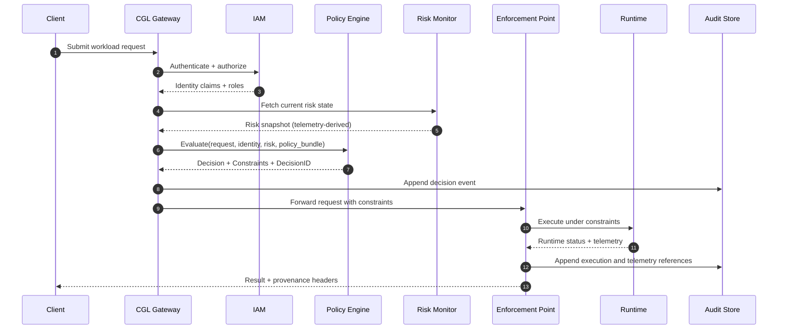

# Architecture

CGL is intentionally split into components that can be deployed independently. You want governance to be boring, composable, and resilient.

## Components

### 1) API Gateway
Responsibilities:
- request authentication (mTLS/OIDC), request normalization
- rate limiting and abuse protection
- request signing and correlation IDs
- “policy context” attachment (policy bundle hash, decision ID)

### 2) Identity & Access (IAM)
Responsibilities:
- identity mapping (human, service, automation)
- role-based access control (RBAC) + attribute-based controls (ABAC)
- step-up auth for high-impact operations
- separation of duties enforcement (e.g., author ≠ approver)

### 3) Policy Engine
Responsibilities:
- evaluate requests against active policy bundles
- compute constraints (coherence budgets, envelopes, runtime settings)
- reference live risk state (telemetry-informed conditions)
- produce deterministic decisions with explanations

### 4) Risk Monitor
Responsibilities:
- ingest runtime telemetry
- compute derived coherence risk metrics
- detect envelope breaches and trend-to-instability
- emit risk events used by policy decisions and incident workflows

### 5) Enforcement Points (EPs)
Where policy becomes real physics constraints.
- API-level gating: deny unsafe operations early
- scheduler-level: budgets and resource constraints
- runtime-level: clamp amplitudes, cap iterations, restrict boundary conditions
- storage-level: deny saving untrusted outputs without provenance

### 6) Audit & Evidence Store
Responsibilities:
- append-only event logs (WORM storage preferred)
- cryptographic hashing and periodic signatures
- evidence queries and retention policies
- tamper detection and chain verification

### 7) Policy Bundle Registry
Responsibilities:
- store signed policy bundles
- support rollbacks and staged rollouts
- maintain “which policy was active when?” history
- distribute policy to policy engines safely

### 8) Governance Workflow
Responsibilities:
- change requests, review routing, approvals
- risk classification and required reviewers
- emergency overrides with post-hoc review
- produce attestation records tied to policy bundle hashes

## Data flow: request to execution

## Failure modes and design choices

### Partition tolerance
If telemetry is missing or stale, CGL should:
- degrade to conservative defaults
- deny high-impact ops
- allow low-risk ops only if policy explicitly permits “telemetry stale mode”

### Policy distribution
Policy bundles must be:
- content-addressed (hash)
- signed by required approvers
- cached locally to avoid “policy outage means runtime outage”

### Determinism
Policy evaluation must be deterministic given:
- request inputs
- identity claims
- risk snapshot
- policy bundle hash

This is what makes audits meaningful.

## Scaling approach
- Scale the gateway horizontally.
- Scale the policy engine as stateless evaluators pulling signed bundles.
- Scale risk monitoring via stream processing (Kafka/PubSub style).
- Keep audit storage append-only and replicated.

