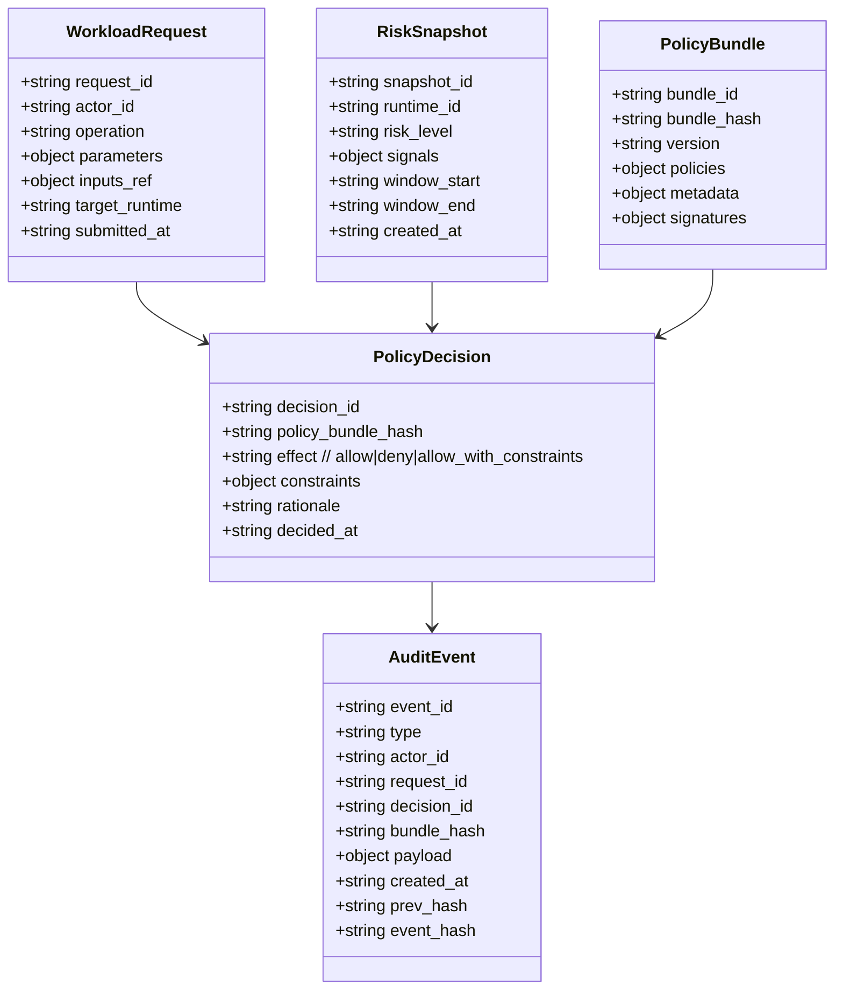

# Data model

CGL uses a small set of canonical objects that appear everywhere: requests, decisions, bundles, telemetry snapshots, and evidence events.

## Object overview

## Identifiers and immutability
- `request_id`, `decision_id`, `event_id` are globally unique.
- `bundle_hash` is **content-addressed** (hash of normalized bundle content).
- Audit events form a hash chain via `prev_hash` → `event_hash`.

## Canonical request fields

### operation (string)
Examples:
- `runtime.execute_simulation`
- `runtime.compile_glyph`
- `runtime.set_boundary_conditions`
- `runtime.export_results`
- `policy.propose_bundle`
- `policy.activate_bundle`

### parameters (object)
Typed per operation. Governance requires schemas for high-risk ops.

### inputs_ref
Inputs should be referenced, not inlined, for:
- size control
- immutability
- provenance tracking

Examples:
- `object_store://coh-data/baselines/sample_input.json#sha256=d6cc1251d3f039f4d87af2f2a114f83d4094f56c526cb97d760dbff2c49abff7`
- `git://repo@commit:path`
- `db://cgl_provenance/inputs/sample_input_v1`

## Constraints object
Constraints are what CGL enforces. Examples:
- `coherence_budget`: numeric
- `signal_envelope`: bounds on 𝒞, gradient, energy injection, spectral ratios
- `runtime_settings`: clamp amplitudes, solver step limits, iteration caps
- `output_controls`: redact, quarantine, watermark, require manual release

## Audit event types (core set)
- `cgl.request.received`
- `cgl.decision.made`
- `cgl.enforcement.applied`
- `cgl.runtime.started`
- `cgl.runtime.telemetry`
- `cgl.runtime.completed`
- `cgl.runtime.quarantined`
- `cgl.policy.bundle.proposed`
- `cgl.policy.bundle.approved`
- `cgl.policy.bundle.activated`
- `cgl.override.invoked`
- `cgl.incident.created`

These correspond to JSON Schemas in `/schemas`.

