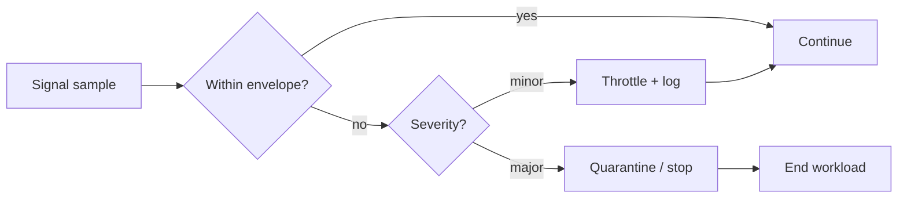

# Enforcement

CGL’s value isn’t in pretty policies; it’s in **making the runtime obey constraints**.

## Enforcement philosophy
- enforce as close to execution as possible
- make violations measurable
- fail safe on uncertainty
- preserve forensic evidence

## Enforcement points

### 1) Gateway enforcement (pre-execution)
- deny disallowed operations
- clamp obvious unsafe parameters
- attach constraints + decision IDs
- apply rate limits

Best for: fast denial, obvious policy checks.

### 2) Scheduler enforcement (batch/HPC)
- enforce coherence budgets as a “resource”
- enforce max runtime and retries
- place risky workloads on isolated nodes/queues

Best for: large jobs, multi-tenant environments.

### 3) Runtime plugin enforcement (in-execution)
- hard clamps on amplitude, excitation, timestep, iterations
- boundary condition templates only
- live envelope monitoring and triggers

Best for: preventing physics from going off the rails *during* execution.

### 4) Output enforcement (post-execution)
- quarantine outputs when envelope breaches occur
- require manual release for risky runs
- add provenance headers and watermarks

Best for: preventing bad output from spreading.

## Live envelope monitoring
A runtime plugin should:
- subscribe to telemetry stream
- compute rolling statistics (p95/p99)
- compare to envelope thresholds
- trigger actions:
  - throttle (reduce amplitude, step size)
  - pause and request operator ack
  - quarantine
  - terminate safely

### Example: envelope breach logic

## Fail-safe modes
When policy evaluation or telemetry is uncertain:
- default deny for high-impact operations
- allow containment operations (stop, quarantine, export evidence)
- allow low-risk ops only if explicitly permitted by policy

## Emergency override
Overrides exist, because reality doesn’t care about your process. But:

- overrides must be explicit operations (`cgl.override.invoke`)
- overrides require strong auth and multi-party approval (or break-glass keys)
- overrides are time-limited and scoped
- overrides trigger immediate incident creation and post-hoc review

## Enforcement receipts
Every enforcement action must emit an auditable “receipt”:
- decision_id
- constraints applied (actual values)
- runtime config hash
- timestamps
- telemetry references

Receipts are what make governance provable.

