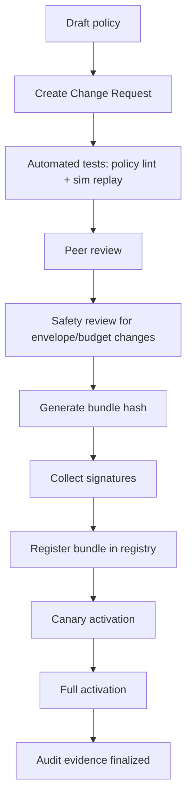

# Policy packaging & attestation

Policy that isn’t auditable is just vibes with YAML. CGL requires **signed, content-addressed policy bundles**.

## Bundle structure
A policy bundle contains:
- bundle metadata (id, version, created_at)
- policies (CPL source + normalized JSON)
- envelopes and budgets (normalized)
- required signatures (approvals)
- optional release constraints (staged rollout, canary targets)

The bundle hash is computed over the **normalized** content (canonical JSON ordering, whitespace-stripped CPL).

## Attestation requirements
At minimum, CGL should require:
- **Author signature** (who wrote it)
- **Reviewer signature** (peer review)
- **Safety signature** (if changes affect envelopes, budgets, or enforcement)
- **Operator signature** (activation in production)

Separation of duties:
- the author cannot be the sole approver
- high-impact changes require at least two distinct roles

## Activation flow

## Rollback and pinning
CGL must support:
- fast rollback to the last known-good bundle
- pinning a specific bundle hash per runtime instance
- “freeze mode” where policy changes are blocked during an incident

## Key management
Signing keys should be stored in:
- hardware-backed key stores (HSM/KMS) where possible
- short-lived tokens for automation
- audited key access logs

Policy engines verify signatures before accepting a bundle.

## Supply-chain protection
To keep “policy injection” from being a thing:
- bundles are pulled by hash, not by mutable “latest”
- registry enforces immutability
- runtime caches only verified bundles
- every decision logs the bundle hash

## Evidence artifacts
For every activation, store:
- bundle hash + version
- signer identities + timestamps
- test run IDs (policy tests, replay simulations)
- canary results (signal envelopes observed)
- activation event IDs in audit log

This turns governance into a forensics-friendly system.

