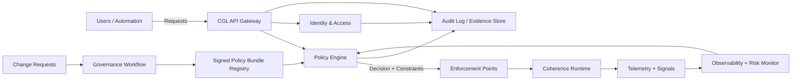

# System context

CGL lives where control, accountability, and physics meet. This section defines boundaries: what CGL touches, what it trusts, and what it refuses to trust.

## Actors
- **Human operators:** researchers, engineers, safety reviewers.
- **Automation:** pipelines, schedulers, CI, data collection agents.
- **Runtime:** the coherence engine that runs workloads.
- **External systems:** identity providers, secrets stores, SIEM, incident tooling.

## High-level responsibilities
CGL must answer four questions for every runtime request:

1. **Who is asking?** (identity, role, authentication strength)
2. **What are they trying to do?** (operation type, parameters, inputs)
3. **Is it safe and permitted right now?** (policy + current telemetry)
4. **Can we prove what happened later?** (audit trail + signatures)

## Trust boundaries
CGL assumes:
- the runtime can be *honest but unstable* (correct computations that can still become unsafe),
- inputs can be *malicious* (glyph injection, adversarial boundary conditions),
- telemetry can be *late or missing* (network partitions happen),
- humans can be *overconfident* (a natural resource, but also a hazard).

Therefore CGL:
- **never** trusts runtime output without attaching provenance and policy context,
- **never** accepts unsigned policy for high-impact operations,
- **always** records decisions and the policy version used.

## Context diagram

## Deployment patterns
CGL can be implemented in several patterns; the architecture docs describe tradeoffs.

1. **API Gateway + Sidecar enforcement (recommended baseline)**  
   - Gateway authenticates, authorizes, logs.
   - Sidecars or plugins enforce constraints near the runtime.

2. **Scheduler-driven enforcement (HPC / batch)**  
   - The scheduler is the enforcement point.
   - Workloads get resource quotas and coherence budgets.

3. **Kernel or runtime shim (highest control, highest risk)**  
   - A thin shim intercepts runtime calls.
   - Useful for hard real-time constraints.

## Minimal viable CGL
Even the smallest serious system should include:
- a policy engine,
- an identity layer,
- immutable audit logs,
- at least one enforcement point close to execution.

