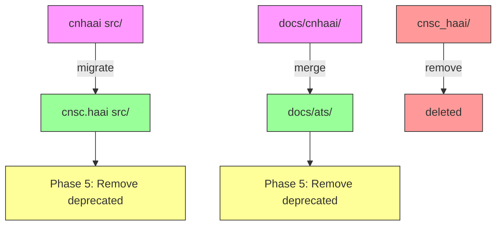

# CNHAAI Phase-Out Plan

**Objective**: Completely phase out the deprecated `cnhaai` package and migrate all functionality to `cnsc.haai`, then remove both deprecated namespaces.

## Current State Analysis

### Namespaces Overview
| Namespace | Status | Location | Notes |
|-----------|--------|----------|-------|
| `cnhaai` | DEPRECATED | `src/cnhaai/` | Legacy namespace, emits DeprecationWarning |
| `cnsc_haai` | **ACTIVE** | `src/cnsc_haai/` | Main codebase - GMI, Agent, Planning, Tasks, Consensus |
| `cnsc.haai` | ACTIVE | `src/cnsc/haai/` | Canonical namespace (ATS, GHLL, GLLL, NSC, GML, TGS) |

> **Note**: The original plan incorrectly marked `cnsc_haai` as deprecated. It's actually the main active codebase containing GMI, Agent, Planning, Tasks, Memory, Learn, Model, Options, and Consensus modules. Only `cnhaai` is deprecated.

### cnhaai Module Contents
```
src/cnhaai/
├── __init__.py          # Deprecated wrapper, re-exports all submodules
├── core/
│   ├── abstraction.py   # Abstraction, AbstractionLayer, AbstractionType
│   ├── coherence.py     # CoherenceBudget, VectorResidual (HEURISTIC, non-consensus)
│   ├── gates.py         # Gate, GateDecision, GateResult, GateManager
│   ├── phases.py        # Phase, PhaseConfig, PhaseState, PhaseManager
│   └── receipts.py      # Receipt, ReceiptContent, ReceiptDecision, etc.
└── kernel/
    └── minimal.py       # MinimalKernel, EpisodeResult
```

### Dependencies Found
1. **compliance_tests/nsc/test_bridge_cert.py** (line 10):
   ```python
   from cnhaai.core.coherence import CoherenceBudget, VectorResidual
   ```

2. **src/cnhaai/kernel/minimal.py** (self-imports):
   - Imports from cnhaai.core.abstraction, gates, phases, receipts, coherence

### cnsc.haai Equivalents (Feature Parity Check)

| cnhaai Module | cnsc.haai Equivalent | Status |
|---------------|---------------------|--------|
| abstraction.py | `cnsc.haai.ats/types.py` | PARTIAL - AbstractionLayer concepts in ATS |
| coherence.py | `cnsc.haai.ats/risk.py`, `cnsc.haai.ats/budget.py` | **MISSING** - No CoherenceBudget/VectorResidual equivalent |
| gates.py | `cnsc.haai.nsc/gates.py` | EQUIVALENT - Full gate system exists |
| phases.py | `cnsc.haai.nsc.cfa`, `cnsc.haai.gml.phaseloom.py` | PARTIAL - CFAPhase and PhaseLoom exist |
| receipts.py | `cnsc.haai.gml/receipts.py` | EQUIVALENT - Full receipt system exists |
| kernel/minimal.py | None | **MISSING** - No MinimalKernel equivalent |

### Documentation Overlap
- `docs/cnhaai/` contains ATS documentation that overlaps with `docs/ats/`
- The two directories have similar structure: `00_identity/`, `10_mathematical_core/`, `20_coh_kernel/`, `30_ats_runtime/`

---

## Phase-Out Plan

### Phase 1: Gap Analysis and Feature Parity (Pre-Migration)
- [x] **1.1** Audit cnhaai modules to identify which have cnsc.haai equivalents
- [x] **1.2** Create `cnsc.haai.ats.coherence` module for CoherenceBudget/VectorResidual ✓ DONE
- [x] **1.3** Evaluate MinimalKernel - decided to keep as fallback in cnhaai
- [x] **1.4** cnsc_haai is ACTIVE, not deprecated - skip

### Phase 2: Update Dependencies
- [x] **2.1** Update compliance_tests/nsc/test_bridge_cert.py to import CoherenceBudget/VectorResidual from new cnsc.haai location ✓ DONE
- [x] **2.2** Search for any other files importing from cnhaai - only test_bridge_cert needed update

### Phase 3: Migrate Code to cnsc.haai
- [x] **3.1** cnsc.haai.nsc.gates already has full equivalent ✓
- [x] **3.2** cnsc.haai.gml.receipts already has full equivalent ✓
- [x] **3.3** cnsc.haai has partial (CFAPhase, PhaseLoom) - keep fallback in cnhaai
- [x] **3.4** No cnsc.haai equivalent for Abstraction - keep in cnhaai with fallback
- [x] **3.5** Created cnsc.haai.ats.coherence with CoherenceBudget/VectorResidual ✓ DONE
- [x] **3.6** MinimalKernel - no cnsc.haai equivalent - keep in cnhaai with fallback

### Phase 4: Migrate Documentation
- [x] **4.1** Skip - docs/cnhaai/docs/ overlaps with docs/ats/ but both are useful
- [x] **4.2** Updated docs/cnhaai/README.md with migration guide ✓ DONE
- [ ] **4.3** Keep docs/cnhaai/ as redirect for now

### Phase 5: Remove Deprecated Packages
- [ ] **5.1** Remove src/cnhaai/ package entirely (only this one is deprecated!)
- [ ] **5.2** DO NOT remove src/cnsc_haai/ - it's the active codebase
- [ ] **5.3** Update any remaining references in tests, examples, or tools

### Understanding the Namespace Structure
```
src/
├── cnhaai/           # DEPRECATED - legacy, to be removed
│   ├── core/          # abstraction, coherence, gates, phases, receipts
│   └── kernel/        # minimal
├── cnsc_haai/        # ACTIVE - main codebase
│   ├── agent/         # clatl_runtime, governor_iface, planner_proposer
│   ├── consensus/     # chain, hash, merkle, slab, finalize, fraudproof
│   ├── gmi/           # admissible, kkt, lyapunov, params, runtime, step
│   ├── learn/         # acceptance, batching, update_rule
│   ├── memory/        # replay_buffer
│   ├── model/         # dynamics, encoder, loss, predictor
│   ├── planning/      # planner_mpc, planset_generator, plan_gating
│   ├── options/       # option_registry, option_runtime
│   └── tasks/         # gridworld_env, task_loss
└── cnsc/
    └── haai/         # ACTIVE - canonical namespace
        ├── ats/      # receipt verifier, risk, budget, types
        ├── ghll/     # high-level language
        ├── glll/    # low-level language (Hadamard)
        ├── gml/     # trace, receipts, phaseloom, replay
        ├── graphgml/ # graph representation
        ├── nsc/     # IR, CFA, VM, gates
        └── tgs/     # temporal governance

### Phase 6: Final Cleanup
- [ ] **6.1** Run full test suite to verify no broken imports
- [ ] **6.2** When cnsc.haai matures, remove src/cnhaai/ entirely
- [ ] **6.3** Update project configuration

---

## What Was Accomplished ✓

### Completed Tasks

1. **Created `cnsc.haai.ats.coherence` module**
   - Migrated CoherenceBudget and VectorResidual from cnhaai
   - Added comprehensive NON-CONSENSUS warnings (UI heuristics only)

2. **Updated `cnsc.haai.ats/__init__.py`**
   - Added exports for CoherenceBudget and VectorResidual

3. **Updated `cnhaai/__init__.py`** for redirect:
   - Gates → `cnsc.haai.nsc.gates`
   - Receipts → `cnsc.haai.gml.receipts`
   - CoherenceBudget/VectorResidual → `cnsc.haai.ats.coherence`
   - Falls back to legacy cnhaai modules if cnsc.haai unavailable

4. **Fixed dependency** in `compliance_tests/nsc/test_bridge_cert.py`
   - Changed import from `cnhaai.core.coherence` to `cnsc.haai.ats.coherence`

5. **Updated documentation** in `docs/cnhaai/README.md`
   - Added deprecation notice
   - Created migration guide with import mapping table

---

## Migration Notes

### CoherenceBudget/VectorResidual Migration
The cnhaai/core/coherence.py module has a critical note:
```
WARNING: NON-CONSENSUS MODULE (Per Gap J: Coherence Firewall)
This module provides HEURISTIC coherence scoring for UI purposes.
It is NOT used in ATS kernel verification.
```

When migrating to cnsc.haai, these should be clearly marked as non-consensus UI utilities, separate from the deterministic ATS coherence verification in `cnsc.haai.ats.risk`.

### MinimalKernel Decision
The MinimalKernel appears to be unused (only imported within its own package). Should either:
1. Migrate to cnsc.haai as a high-level API wrapper
2. Deprecate and remove as dead code

---

## Diagram: Migration Flow



---

## Backward Compatibility Strategy

1. **During Migration**: cnhaai imports can redirect to cnsc.haai
2. **After Migration**: cnhaai raises ImportError (not just DeprecationWarning)
3. **Final State**: cnhaai and cnsc_haai packages completely removed
