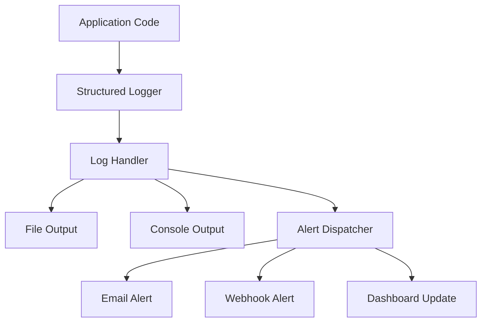

# Logging and Alerting Plan for Crash Detection

## Overview

Implement comprehensive logging and alerting infrastructure to detect, track, and respond to system crashes and errors in real-time.

## Architecture



## Components to Implement

### 1. Structured Logger

**File:** `src/haai/core/logging.py`

```python
import logging
import json
import sys
from datetime import datetime
from typing import Dict, Any, Optional

class CrashDetectionLogger:
    """Structured logger with crash detection capabilities."""
    
    def __init__(self, name: str, log_file: str = "crash_detection.log"):
        self.logger = logging.getLogger(name)
        self.logger.setLevel(logging.DEBUG)
        self.log_file = log_file
        
        # JSON formatter for structured logs
        formatter = logging.Formatter('%(asctime)s - %(name)s - %(levelname)s - %(message)s')
        
        # File handler with rotation
        file_handler = logging.FileHandler(log_file)
        file_handler.setFormatter(formatter)
        self.logger.addHandler(file_handler)
        
        # Console handler
        console_handler = logging.StreamHandler(sys.stdout)
        console_handler.setFormatter(formatter)
        self.logger.addHandler(console_handler)
    
    def log_crash(self, error: Exception, context: Dict[str, Any] = None) -> str:
        """Log a crash event and return crash ID."""
        crash_id = f"CRASH-{datetime.now().strftime('%Y%m%d%H%M%S')}-{id(error)}"
        
        crash_data = {
            "crash_id": crash_id,
            "error_type": type(error).__name__,
            "error_message": str(error),
            "context": context or {},
            "timestamp": datetime.now().isoformat(),
            "stack_trace": self._get_traceback(error)
        }
        
        self.logger.critical(f"CRASH DETECTED: {json.dumps(crash_data)}")
        return crash_id
    
    def _get_traceback(self, error: Exception) -> str:
        """Extract traceback from exception."""
        import traceback
        return "".join(traceback.format_exception(type(error), error, error.__traceback__))
```

---

### 2. Global Exception Handler

**File:** `src/haai/core/exception_handler.py`

```python
import sys
import signal
import threading
from typing import Callable, Optional
from .logging import CrashDetectionLogger

class GlobalExceptionHandler:
    """Catches unhandled exceptions globally."""
    
    def __init__(self, logger: CrashDetectionLogger):
        self.logger = logger
        self.original_handlers = {}
    
    def install(self) -> None:
        """Install global exception handlers."""
        # Set up signal handlers for graceful shutdown
        signal.signal(signal.SIGTERM, self._handle_signal)
        signal.signal(signal.SIGINT, self._handle_signal)
        
        # Set up thread exception hook
        threading.excepthook = self._handle_thread_exception
        
        # Set up uncaught exception handler
        sys.excepthook = self._handle_uncaught_exception
        
        self.logger.logger.info("Global exception handler installed")
    
    def _handle_uncaught_exception(self, exc_type, exc_value, exc_traceback):
        """Handle uncaught exceptions in main thread."""
        self.logger.log_crash(exc_value, {
            "source": "main_thread",
            "uncaught": True
        })
        # Call original handler if exists
        if self.original_handlers.get('excepthook'):
            self.original_handlers['excepthook'](exc_type, exc_value, exc_traceback)
        else:
            sys.__excepthook__(exc_type, exc_value, exc_traceback)
    
    def _handle_thread_exception(self, args):
        """Handle exceptions in background threads."""
        self.logger.log_crash(args.exception, {
            "source": "thread",
            "thread_name": args.thread.name
        })
    
    def _handle_signal(self, signum, frame):
        """Handle termination signals."""
        self.logger.logger.info(f"Received signal {signum}, shutting down gracefully...")
        sys.exit(0)
```

---

### 3. Alert Dispatcher

**File:** `src/haai/core/alert_dispatcher.py`

```python
import asyncio
import aiohttp
import smtplib
from email.mime.text import MIMEText
from typing import List, Dict, Any, Optional
from datetime import datetime, timedelta

class AlertDispatcher:
    """Dispatches alerts via multiple channels."""
    
    def __init__(self, config: Dict[str, Any]):
        self.config = config
        self.alert_history: List[Dict[str, Any]] = []
        self.rate_limit_window = timedelta(minutes=5)
        self.max_alerts_per_window = 5
    
    async def dispatch_crash_alert(self, crash_data: Dict[str, Any]) -> None:
        """Dispatch crash alert to all configured channels."""
        alert = {
            "crash_id": crash_data["crash_id"],
            "timestamp": datetime.now().isoformat(),
            "severity": "CRITICAL",
            "data": crash_data
        }
        
        # Rate limiting
        recent_alerts = [a for a in self.alert_history 
                        if datetime.now() - datetime.fromisoformat(a["timestamp"]) < self.rate_limit_window]
        
        if len(recent_alerts) >= self.max_alerts_per_window:
            self._log_suppressed_alert(alert)
            return
        
        self.alert_history.append(alert)
        
        # Dispatch to all channels
        tasks = []
        
        if self.config.get("email_enabled"):
            tasks.append(self._send_email_alert(alert))
        
        if self.config.get("webhook_enabled"):
            tasks.append(self._send_webhook_alert(alert))
        
        if self.config.get("slack_enabled"):
            tasks.append(self._send_slack_alert(alert))
        
        await asyncio.gather(*tasks, return_exceptions=True)
    
    async def _send_email_alert(self, alert: Dict[str, Any]) -> None:
        """Send email alert."""
        if not self.config.get("smtp_config"):
            return
        
        smtp_config = self.config["smtp_config"]
        msg = MIMEText(f"CRASH DETECTED\n\n{alert['data']}")
        msg["Subject"] = f"[CRITICAL] System Crash: {alert['crash_id']}"
        msg["From"] = smtp_config["from_addr"]
        msg["To"] = ", ".join(smtp_config["to_addrs"])
        
        try:
            with smtplib.SMTP(smtp_config["host"], smtp_config["port"]) as server:
                server.starttls()
                server.login(smtp_config["username"], smtp_config["password"])
                server.send_message(msg)
        except Exception as e:
            print(f"Failed to send email alert: {e}")
    
    async def _send_webhook_alert(self, alert: Dict[str, Any]) -> None:
        """Send webhook alert."""
        webhook_url = self.config.get("webhook_url")
        if not webhook_url:
            return
        
        try:
            async with aiohttp.ClientSession() as session:
                async with session.post(webhook_url, json=alert) as response:
                    if response.status != 200:
                        print(f"Webhook alert failed: {response.status}")
        except Exception as e:
            print(f"Failed to send webhook alert: {e}")
    
    async def _send_slack_alert(self, alert: Dict[str, Any]) -> None:
        """Send Slack alert."""
        slack_webhook = self.config.get("slack_webhook")
        if not slack_webhook:
            return
        
        message = {
            "text": f"🚨 *CRASH DETECTED*",
            "attachments": [{
                "color": "danger",
                "fields": [
                    {"title": "Crash ID", "value": alert["crash_id"], "short": True},
                    {"title": "Error Type", "value": alert["data"]["error_type"], "short": True},
                    {"title": "Error Message", "value": alert["data"]["error_message"], "short": False}
                ]
            }]
        }
        
        try:
            async with aiohttp.ClientSession() as session:
                async with session.post(slack_webhook, json=message) as response:
                    if response.status != 200:
                        print(f"Slack alert failed: {response.status}")
        except Exception as e:
            print(f"Failed to send Slack alert: {e}")
    
    def _log_suppressed_alert(self, alert: Dict[str, Any]) -> None:
        """Log when an alert is suppressed due to rate limiting."""
        print(f"Alert suppressed due to rate limiting: {alert['crash_id']}")
```

---

### 4. Health Dashboard Endpoint

**File:** `src/haai/core/health_dashboard.py`

```python
from flask import Flask, jsonify
from datetime import datetime, timedelta
from collections import deque

app = Flask(__name__)

# In-memory crash history (use Redis in production)
crash_history = deque(maxlen=1000)

@app.route("/health/crashes", methods=["GET"])
def get_crash_history():
    """Get recent crash history."""
    return jsonify({
        "crashes": list(crash_history),
        "total_count": len(crash_history)
    })

@app.route("/health/stats", methods=["GET"])
def get_crash_stats():
    """Get crash statistics."""
    now = datetime.now()
    hour_ago = now - timedelta(hours=1)
    day_ago = now - timedelta(days=1)
    
    recent_crashes = [c for c in crash_history 
                     if datetime.fromisoformat(c["timestamp"]) > hour_ago]
    daily_crashes = [c for c in crash_history 
                    if datetime.fromisoformat(c["timestamp"]) > day_ago]
    
    return jsonify({
        "last_hour_count": len(recent_crashes),
        "last_24h_count": len(daily_crashes),
        "total_count": len(crash_history),
        "status": "healthy" if len(recent_crashes) == 0 else "degraded"
    })
```

---

### 5. Integration with HAAI Agent

**File:** `src/haai/agent/crash_monitoring.py`

```python
from ..core.logging import CrashDetectionLogger
from ..core.exception_handler import GlobalExceptionHandler
from ..core.alert_dispatcher import AlertDispatcher

class CrashMonitoringIntegration:
    """Integrates crash detection with HAAI agent."""
    
    def __init__(self, agent, config: dict = None):
        self.agent = agent
        self.config = config or {}
        
        # Initialize logger
        self.logger = CrashDetectionLogger(
            f"haai.agent.{agent.agent_id}",
            log_file=f"logs/crash_{agent.agent_id}.log"
        )
        
        # Initialize exception handler
        self.exception_handler = GlobalExceptionHandler(self.logger)
        
        # Initialize alert dispatcher
        self.alert_dispatcher = AlertDispatcher(self.config.get("alerts", {}))
    
    def enable(self) -> None:
        """Enable crash monitoring."""
        self.exception_handler.install()
        self.agent.state.error_log.append(
            f"Crash monitoring enabled |{datetime.now().isoformat()}"
        )
        self.logger.logger.info("Crash monitoring enabled for agent")
```

---

## Configuration

**File:** `config/crash_detection.yaml`

```yaml
logging:
  level: DEBUG
  log_directory: logs/
  max_file_size_mb: 100
  backup_count: 10

alerts:
  email_enabled: true
  smtp_config:
    host: smtp.example.com
    port: 587
    username: alerts@example.com
    password: ${SMTP_PASSWORD}
    from_addr: haai-alerts@example.com
    to_addrs:
      - devops@example.com
  
  webhook_enabled: true
  webhook_url: https://monitoring.example.com/webhooks/crashes
  
  slack_enabled: true
  slack_webhook: https://hooks.slack.com/services/xxx/yyy/zzz
  
  rate_limit:
    window_minutes: 5
    max_alerts: 5

health_endpoint:
  enabled: true
  port: 8080
```

---

## Dashboard Integration

### Grafana Dashboard (grafana/dashboard.json)

```json
{
  "dashboard": {
    "title": "HAAI Crash Detection",
    "panels": [
      {
        "title": "Crashes per Hour",
        "type": "graph",
        "targets": [
          {
            "expr": "rate(haai_crashes_total[1h])"
          }
        ]
      },
      {
        "title": "Recent Crashes",
        "type": "table",
        "targets": [
          {
            "expr": "haai_crashes"
          }
        ]
      }
    ]
  }
}
```

---

## Implementation Priority

| Priority | Component | Effort |
|----------|-----------|--------|
| 1 | Structured Logger | 2 hours |
| 2 | Global Exception Handler | 1 hour |
| 3 | Alert Dispatcher | 3 hours |
| 4 | Health Dashboard | 2 hours |
| 5 | Agent Integration | 1 hour |
| 6 | Dashboard Metrics | 2 hours |

**Total estimated effort:** ~11 hours

---

## Success Criteria

- [ ] All unhandled exceptions are logged with crash IDs
- [ ] Critical alerts sent within 30 seconds of crash
- [ ] Health endpoint responds with crash statistics
- [ ] Dashboard shows real-time crash data
- [ ] Rate limiting prevents alert spam
