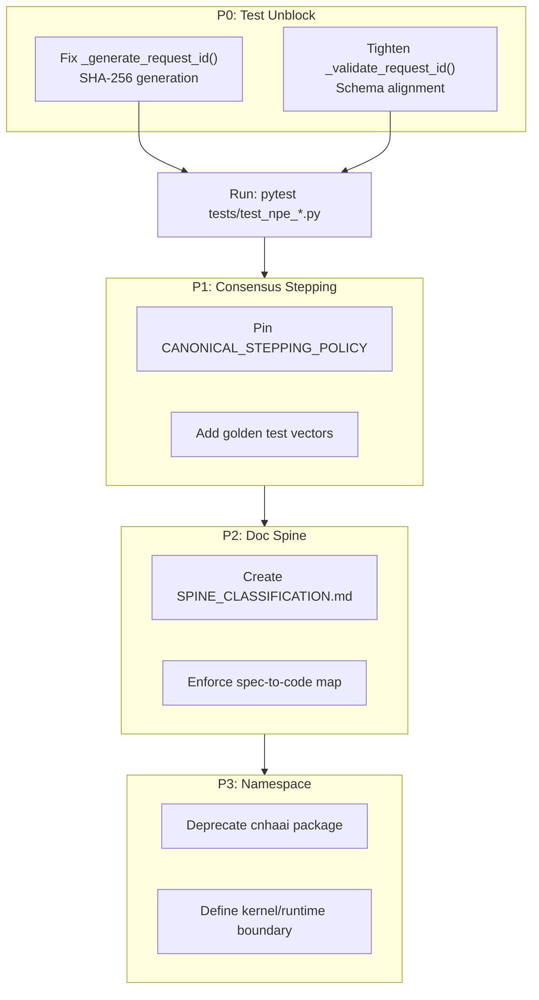

# NPE Request ID Fix and Consensus Improvement Plan

> **Status**: Active Planning  
> **Created**: 2026-02-24  
> **Based on**: cnsc-haai-main(14).zip audit findings

---

## Executive Summary

The repository is close to full test pass. The primary blocker is a **schema mismatch** where `_generate_request_id()` produces UUIDs but `npe_request.schema.json` requires SHA-256 hex (64 characters). This affects two test files:
- `tests/test_npe_integration.py`
- `tests/test_npe_performance.py`

The consensus kernel shows significant improvement with proper `receipt_id` vs `chain_digest` separation, but the continuous-time stepping seam remains underspecified.

---

## P0: Unblock Test Suite

### Task 1: Fix NPE Request ID Generation

**File**: [`src/cnsc/haai/nsc/proposer_client.py`](src/cnsc/haai/nsc/proposer_client.py:517)

**Current Code** (lines 517-523):
```python
def _generate_request_id(self) -> str:
    """Generate a unique request ID.
    
    Returns:
        Unique request ID string (UUID format)
    """
    return str(uuid.uuid4())
```

**Problem**: 
- Generates UUID (e.g., `e5862d5e-...`)
- Schema requires: `^[a-f0-9]{64}$` (SHA-256 hex)

**Implementation**:
```python
import hashlib
import os
import time
from typing import Optional

# Add at module level or class level
_PROCESS_SALT = os.urandom(16)

def _generate_request_id(self) -> str:
    """Generate a unique request ID as SHA-256 hex.
    
    Uses: random_32_bytes || timestamp || process_salt
    Returns 64 hex characters per schema requirement.
    
    Returns:
        SHA-256 hash string (64 hex characters)
    """
    # Get timestamp at nanosecond precision for uniqueness
    timestamp_bytes = str(time.time_ns()).encode('utf-8')
    
    # Combine: random || timestamp || salt
    hash_input = os.urandom(32) + timestamp_bytes + _PROCESS_SALT
    
    # Return SHA-256 hex digest (64 chars)
    return hashlib.sha256(hash_input).hexdigest()
```

**Verification**:
- Ensure output matches regex: `^[a-f0-9]{64}$`
- Run: `pytest tests/test_npe_integration.py -v`
- Run: `pytest tests/test_npe_performance.py -v`

---

### Task 2: Tighten Request ID Validation

**File**: [`src/cnsc/haai/nsc/proposer_client.py`](src/cnsc/haai/nsc/proposer_client.py:338)

**Current Code** (lines 365-382):
```python
# Allow UUID format (e.g., "550e8400-e29b-41d4-a716-446655440000")
uuid_pattern = r'^[0-9a-f]{8}-[0-9a-f]{4}-[0-9a-f]{4}-[0-9a-f]{4}-[0-9a-f]{12}$'
# Allow SHA-256 hex format (64 hex characters)
sha256_pattern = r'^[a-f0-9]{64}$'
# Allow timestamp-based format (e.g., "ts_1704067200")
timestamp_pattern = r'^ts_[0-9]{10}$'

is_valid = (
    re.match(uuid_pattern, request_id.lower()) or
    re.match(sha256_pattern, request_id.lower()) or
    re.match(timestamp_pattern, request_id)
)
```

**Problem**:
- Validation accepts UUIDs and timestamp-based formats
- Schema only allows SHA-256: `^[a-f0-9]{64}$`

**Implementation** (tighten to match schema):
```python
# Only allow SHA-256 hex format per schema
sha256_pattern = r'^[a-f0-9]{64}$'

if not re.match(sha256_pattern, request_id.lower()):
    raise ValidationError(
        field="request_id",
        message="Invalid request ID format. Must be SHA-256 hex (64 characters)"
    )
```

**Alternative**: If external systems may send valid UUIDs, keep validation loose but ensure generation produces SHA-256. However, schema compliance suggests tightening.

---

### Task 3: Verify Schema Alignment

**File**: [`src/npe/schemas/npe_request.schema.json`](src/npe/schemas/npe_request.schema.json:14-17)

The schema correctly requires:
```json
"request_id": {
  "type": "string",
  "pattern": "^[a-f0-9]{64}$",
  "description": "SHA-256 hash (64 hex characters) uniquely identifying this request."
}
```

No changes needed to schema - code must conform.

---

## P1: Lock Consensus Stepping

### Task 4: Implement Canonical Deterministic Stepping Policy

**File**: [`src/cnsc_haai/consensus/continuous.py`](src/cnsc_haai/consensus/continuous.py:98)

**Current State**: The `advance(dt_q)` method exists but stepping policy is not explicitly pinned.

**Required Implementation**:

```python
# Add explicit stepping policy constants and enforcement
from enum import Enum

class SteppingPolicy(Enum):
    """Canonical stepping policies for continuous trajectories."""
    DISCRETE_MICRO_STEPS = "discrete_micro_steps"  # Only discrete for now
    # Future: ADAPTIVE_STEP = "adaptive"
    # Future: VARIABLE_DT = "variable_dt"

# At module level - pin the policy
CANONICAL_STEPPING_POLICY = SteppingPolicy.DISCRETE_MICRO_STEPS
CANONICAL_DT_Q = 1  # QFixed: 1 unit step
MAX_STEPS_PER_ADVANCE = 1000  # Prevent infinite loops

def compute_canonical_steps(dt_q: int) -> int:
    """
    Compute the number of canonical micro-steps for a given dt.
    
    This is the ONLY legal way to convert continuous time to discrete steps.
    
    Args:
        dt_q: Time delta in QFixed (scaled by 10^18)
        
    Returns:
        Number of canonical micro-steps
    """
    if dt_q <= 0:
        return 0
    
    # Currently: 1:1 mapping (dt_q units = dt_q steps)
    # This is the pinned stepping law
    steps = int(dt_q / CANONICAL_DT_Q)
    
    if steps > MAX_STEPS_PER_ADVANCE:
        raise ValueError(
            f"dt_q={dt_q} exceeds maximum steps {MAX_STEPS_PER_ADVANCE}. "
            f"Use smaller dt or chunked advancement."
        )
    
    return steps

def advance(self, dt_q: int) -> Optional[Dict[str, Any]]:
    """
    Advance continuous trajectory by dt using CANONICAL stepping policy.
    
    This is the ONLY public method for advancing time.
    It enforces the pinned stepping law.
    
    Args:
        dt_q: Time delta in QFixed
        
    Returns:
        Final state dict or None if advancement fails
    """
    # Enforce canonical policy
    num_steps = compute_canonical_steps(dt_q)
    
    for step in range(num_steps):
        result = self._step_engine(self._x_state, self._budget_q)
        # Update state and budget
        self._x_state = result.get('state', self._x_state)
        self._budget_q = result.get('budget_q', self._budget_q)
        
        # Emit micro-receipt if slab buffer provided
        if self._slab_buffer is not None:
            receipt = self._create_micro_receipt(step)
            self._slab_buffer.append(receipt)
    
    return self._x_state
```

**Golden Test Vectors Needed**:
```
Input: dt_q = 1_000_000_000_000_000  (1 second in QFixed)
Expected: 1 micro-step

Input: dt_q = 5_000_000_000_000_000  (5 seconds)
Expected: 5 micro-steps
```

---

### Task 5: Add Golden Test Vectors for Continuous Stepping

**Location**: `compliance_tests/ats_slab/vector_bundle_v1/` (extend existing)

Create new test vectors:
- `continuous_stepping_vectors.json`: Deterministic stepping inputs/outputs
- `boundary_conditions.json`: Edge cases at slab boundaries

---

## P2: Eliminate Multi-Spine Drift

### Task 6: Document Spine Classification

**File**: Create/update `docs/SPINE_CLASSIFICATION.md`

```markdown
# Documentation Spine Classification

> This document declares the canonical status of each documentation directory.

## Normative (Protocol Truth - Source of Truth)

These documents define bytes, hashes, schemas, and core invariants:

| Directory | Description |
|-----------|-------------|
| `docs/ats/10_mathematical_core/` | Core math (state space, action algebra, risk) |
| `docs/ats/20_coh_kernel/` | Kernel primitives (receipt, chain hash, serialization) |
| `docs/spec/` | System overview, ledger truth contract |
| `src/npe/schemas/` | JSON schemas (machine-readable truth) |

## Informative (Explanatory)

These documents explain and contextualize but are not protocol truth:

| Directory | Description |
|-----------|-------------|
| `docs/coh-agi/` | Conceptual system layer |
| `docs/guides/` | How-to guides |
| `docs/architecture/` | High-level architecture |

## Legacy (Deprecated - Do Not Edit)

| Directory | Status |
|-----------|--------|
| `docs/spine/` | DEPRECATED per docs/SPINE.md |
| `docs/cnhaai/` | Migrated to `docs/ats/` |
| `docs/gmi/` | Informative only |

---

## Primitive Definition Registry

| Primitive | Canonical Definition Location |
|-----------|------------------------------|
| `receipt_id` | `docs/ats/20_coh_kernel/receipt_identity.md` |
| `chain_digest` | `docs/ats/20_coh_kernel/chain_hash_rule.md` |
| `state_hash` | `docs/ats/20_coh_kernel/deterministic_numeric_domain.md` |
| `slab_id` | `docs/ats/20_coh_kernel/receipt_schema.md` |
```

---

### Task 7: Enforce Spec-to-Code Map

**Location**: `docs/ats/01_spec_to_code_map.md`

Ensure CI can validate:
- Schema checksums match committed specs
- Key code files reference correct spec IDs

---

## P3: Namespace Cleanup

### Task 8: Deprecate Legacy `cnhaai/` Package

**Current**: `src/cnhaai/` exists but should be deprecated

**Implementation**:

Option A: Create stub that raises error
```python
# src/cnhaai/__init__.py
import warnings

warnings.warn(
    "cnhaai package is deprecated. Use cnsc_haai (protocol kernel) "
    "or cnsc.haai (runtime) instead.",
    DeprecationWarning,
    stacklevel=2
)

# Then re-export from canonical packages
from cnsc_haai import *  # Or selective imports
```

Option B: Move to `src/_legacy/`

---

### Task 9: Define Clear Kernel/Runtime Boundary

**Current State**:
- `cnsc_haai/` = Protocol kernel (consensus, hashing, merkle)
- `cnsc.haai/` = Runtime (ghll, glll, gml, nsc, tgs)

**Documentation**: Create `docs/BOUNDARY_CONTRACT.md`

```markdown
# Runtime/Kernel Boundary Contract

## Protocol Kernel (`cnsc_haai`)
- Pure functions, no side effects
- Deterministic hashing primitives
- Consensus-critical operations only

## Runtime (`cnsc.haai`)
- Side-effectful operations
- User interaction
- IO-bound operations

## Seam Module
All kernel imports must go through explicit seam:
- `cnsc.haai.kernel_interface` - imports from cnsc_haai
- Exposes stable API for runtime use
```

---

## Verification Checklist

After implementing P0:

- [ ] `pytest tests/test_npe_integration.py -v` - All pass
- [ ] `pytest tests/test_npe_performance.py -v` - All pass
- [ ] Manual verification: Request IDs are 64-char hex strings

After implementing P1:

- [ ] `advance()` uses pinned stepping policy
- [ ] Golden vectors exist and pass
- [ ] Continuous stepping is deterministic

After implementing P2:

- [ ] `docs/SPINE_CLASSIFICATION.md` exists
- [ ] Each primitive has single canonical definition

After implementing P3:

- [ ] `cnhaai/` shows deprecation warning
- [ ] Boundary contract documented

---

## Architecture Diagram



---

## Next Steps

1. **Immediate**: Implement Task 1 (fix `_generate_request_id()`)
2. **Verify**: Run NPE integration tests
3. **Continue**: Implement Task 2-3 if tests pass
4. **Iterate**: Move to P1-P3 as needed
