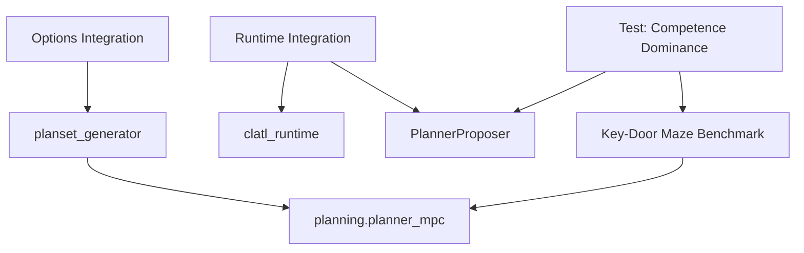

# Phase 3 Completion Implementation Plan

## Executive Summary

This plan addresses the three missing components to complete Phase 3:

1. **Competence Dominance Test** - Planner must beat Phase-2 baseline on planning-required benchmark
2. **Options Integration** - Planning must use skills/options (deterministic option unfolding)
3. **Runtime Integration** - Wire planning mode into CLATL runtime

## Current State Analysis

### What's Already Implemented ✅

| Component | Location | Status |
|-----------|----------|--------|
| Planning Engine | `src/cnsc_haai/planning/` | Complete |
| Phase 3 Tests (Governance) | `compliance_tests/phase3/` | 4/5 tests |
| Options Module | `src/cnsc_haai/options/` | Implemented but not integrated |
| Planner Proposer | `src/cnsc_haai/agent/planner_proposer.py` | Bridge exists |
| Benchmarks | `tasks/benchmarks/key_door_maze.py` | Planning-forcing benchmark exists |

### What's Missing ❌

1. No competence comparison test (`test_planner_beats_phase2_baseline.py`)
2. Zero references to `cnsc_haai.options` inside `cnsc_haai.planning`
3. Runtime doesn't switch to planner mode by default

---

## Implementation Steps

### Step 1: Add Competence Dominance Test

**File:** `compliance_tests/phase3/test_planner_beats_phase2_baseline.py`

**Purpose:** Prove that MPC planning outperforms reactive Phase-2 baseline on Key-Door Maze.

**Test Logic:**

```python
# Run N episodes with planner (using PlannerProposer)
planner_episodes = run_key_door_episodes(num_episodes=20, use_planner=True)

# Run N episodes with Phase-2 baseline (reactive)
baseline_episodes = run_key_door_episodes(num_episodes=20, use_planner=False)

# Compare metrics
planner_success_rate = sum(e.success for e in planner_episodes) / N
baseline_success_rate = sum(e.success for e in baseline_episodes) / N

# Assert planner beats baseline
assert planner_success_rate > baseline_success_rate
```

**Anti-Gaming Measures:**

- Minimum N=20 episodes for statistical significance
- Same random seed range for both configurations
- Must achieve goal (not just avoid hazards)
- Exclude episodes where baseline never enters deadlock state
- Record average steps-to-goal as secondary metric

**Key-Door Maze Forces Planning:**
- Reactive agents go directly to goal, get blocked by door
- Planner must: (1) get key first, (2) open door, (3) go to goal

---

### Step 2: Integrate Options into Plan Generation (Option A - Simpler)

**File:** `src/cnsc_haai/planning/planset_generator.py`

**Change:** Add deterministic option unfolding during plan generation.

**Implementation:**

1. Import options module:
```python
from cnsc_haai.options import get_option, list_options
```

2. Add optional `use_options: bool` parameter to `generate_planset()`

3. When options enabled:
   - For each option in available options:
     - Call `execute_option_steps(state, option_id, max_steps=H)` to get primitive sequence
     - Convert to plan actions
   - Include option-derived plans alongside primitive plans

4. Option templates (e.g., "GoToGoalGreedy") unfold to:
   - Greedy path to goal
   - Bounded by horizon H
   - Deterministic given state hash

**Rationale for Option A:**
- Simpler receipts (primitive-only)
- Maintains replay determinism
- Faster to implement than Option B (macro-actions)

---

### Step 3: Wire Planning Mode into CLATL Runtime

**File:** `src/cnsc_haai/agent/clatl_runtime.py`

**Change:** Add `use_planner: bool` parameter to episode runner.

**Implementation:**

1. Add parameter to `run_clatl_episode()`:
```python
def run_clatl_episode(
    env: GridWorldEnv,
    proposer: TaskProposer,
    gmi_params: GMIParams,
    seed: int = 42,
    use_planner: bool = False,  # NEW PARAMETER
    planner_config: Optional[PlannerConfig] = None,
) -> CLATLEpisodeReceipt:
```

2. When `use_planner=True`:
   - Replace proposer with `PlannerProposer`
   - Configure `planner_config` with appropriate settings
   - Pass through planner results to governance

3. Add convenience function:
```python
def create_planning_proposer(
    goal: Tuple[int, int],
    hazards: List[Tuple[int, int]],
    grid_bounds: Tuple[int, int],
) -> PlannerProposer:
    """Create a planner proposer for use in episodes."""
```

---

## Test Acceptance Criteria

After implementation, these tests must pass:

| Test | File | Requirement |
|------|------|-------------|
| Existing 4 Phase 3 tests | `compliance_tests/phase3/*.py` | Pass (regression) |
| New competence test | `test_planner_beats_phase2_baseline.py` | Pass |
| Options integration | Manual verification | Plans include option-derived sequences |
| Runtime integration | Manual verification | `use_planner=True` enables planning |

---

## Dependencies



---

## File Changes Summary

| File | Change Type | Description |
|------|-------------|-------------|
| `compliance_tests/phase3/test_planner_beats_phase2_baseline.py` | **NEW** | Competence comparison test |
| `src/cnsc_haai/planning/planset_generator.py` | **MODIFY** | Add option unfolding |
| `src/cnsc_haai/agent/clatl_runtime.py` | **MODIFY** | Add `use_planner` parameter |

---

## Implementation Order

1. **First:** Add competence dominance test (validates what's missing)
2. **Second:** Wire runtime to use planner (quick integration)
3. **Third:** Integrate options into plan generation (Option A)

This order ensures:
- Test validates the gap before fixing
- Runtime integration is straightforward
- Options integration is the most complex change

---

## Notes

- The existing `PlannerProposer` already provides the bridge between planning and CLATL
- The benchmark `key_door_maze.py` is specifically designed to force planning behavior
- Option A (unfold at generation time) is preferred for simpler receipts and replay
