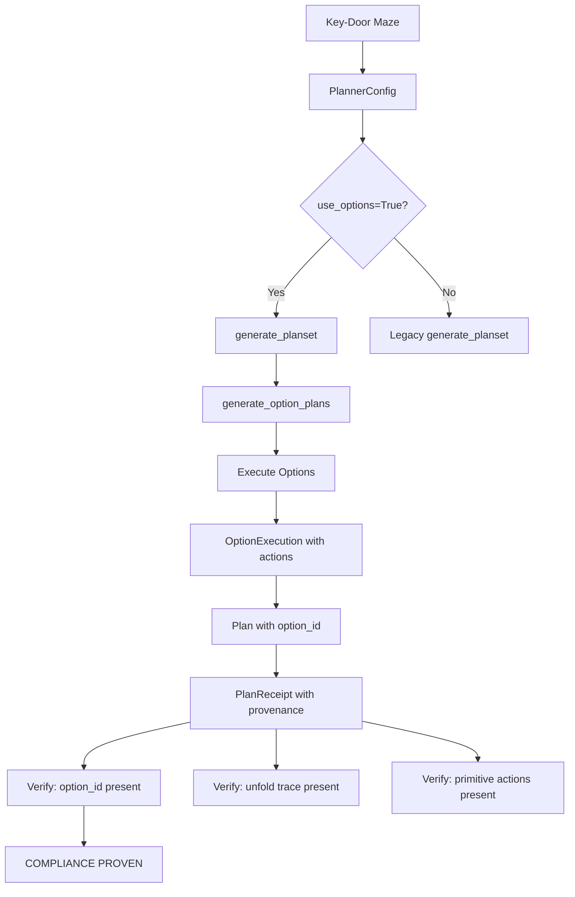

# Phase 3 Skills Integration Proof - Implementation Plan

## Executive Summary

This plan addresses the gaps between the current `test_options_are_used_and_receipted.py` test and the full compliance requirements specified in the task. The current test verifies basic option generation and deterministic receipts, but is missing the key compliance assertions required by the spec.

---

## Current State Analysis

### What's Already Implemented

| Component | Status | Location |
|-----------|--------|----------|
| Options Registry | ✅ Complete | `src/cnsc_haai/options/option_registry.py` |
| Option Runtime | ✅ Complete | `src/cnsc_haai/options/option_runtime.py` |
| Option Receipts | ✅ Complete | `src/cnsc_haai/options/option_receipts.py` |
| `generate_option_plans()` | ✅ Complete | `src/cnsc_haai/planning/planset_generator.py` |
| Key-Door Maze Benchmark | ✅ Complete | `src/cnsc_haai/tasks/benchmarks/key_door_maze.py` |
| Current Test File | ⚠️ Partial | `compliance_tests/phase3/test_options_are_used_and_receipted.py` |

### What's Missing (Gap Analysis)

1. **PlannerConfig has no `use_options` flag** - Options cannot be enabled in the planner
2. **`generate_planset()` doesn't integrate options** - The main planner doesn't call `generate_option_plans()`
3. **No end-to-end test with Key-Door Maze** - The benchmark exists but isn't used in tests
4. **Missing compliance assertions:**
   - "at least one option invocation occurs within M steps (or across K episodes)"
   - "option invocation is receipted with option id"
   - "option determinism breaks replay" (fail condition test)
5. **No integration between option receipts and plan receipts** - The receipts aren't linked

---

## Implementation Steps

### Step 1: Add Options Enable Flag to PlannerConfig

**File:** `src/cnsc_haai/planning/planner_mpc.py`

Add to `PlannerConfig`:
```python
use_options: bool = False          # Enable options in planning
option_horizon: int = 10           # Max steps for option plans
```

### Step 2: Integrate Options into PlanSet Generation

**File:** `src/cnsc_haai/planning/planset_generator.py`

Modify `generate_planset()` to optionally include option-derived plans:
```python
def generate_planset(
    horizon: int,
    num_plans: int,
    seed: int,
    include_special_plans: bool = True,
    use_options: bool = False,     # NEW
    state: GMIState = None,         # NEW - needed for options
    goal_position: Tuple[int, int] = None,  # NEW
    hazard_mask = None,             # NEW
) -> PlanSet:
    # ... existing code ...
    
    # NEW: Add option-derived plans
    if use_options and state is not None:
        option_plans = generate_option_plans(
            state=state,
            goal_position=goal_position,
            hazard_mask=hazard_mask,
            horizon=min(option_horizon, horizon),
        )
        plans.extend(option_plans)
```

### Step 3: Update Main Planner to Use Options

**File:** `src/cnsc_haai/planning/planner_mpc.py`

Modify `plan_and_select()` to:
1. Pass `use_options` flag to `generate_planset()`
2. Track which plans came from options
3. Include option provenance in receipts

### Step 4: Create Option-Plan Linkage in Receipts

**File:** `src/cnsc_haai/planning/plan_receipts.py`

Add option provenance to `Plan`:
```python
@dataclass(frozen=True)
class Plan:
    actions: Tuple[GMIAction, ...]
    horizon: int
    plan_hash: str
    option_id: Optional[str] = None  # NEW: links to skill
    option_trace: Optional[Tuple[str, ...]] = None  # NEW: unfold trace
```

### Step 5: Add Compliance Tests to Test File

**File:** `compliance_tests/phase3/test_options_are_used_and_receipted.py`

Add these new test functions:

```python
def test_options_used_in_key_door_maze():
    """
    COMPLIANCE: Run Key-Door Maze where option is beneficial.
    Assert at least one option is invoked within M steps.
    """
    # Create Key-Door Maze environment
    maze = create_key_door_maze()
    
    # Configure planner with options enabled
    config = PlannerConfig(use_options=True)
    
    # Run for M steps or K episodes
    for episode in range(K):
        state = maze.reset()
        for step in range(M):
            # Plan with options
            result = plan_and_select(state, config)
            
            # Execute and observe
            maze.step(result.action)
            
            # Check if option was used (via receipts)
            assert option_was_used(result.receipts), \
                "Option should be invoked within M steps"
            
    # SUCCESS: Compliance proven

def test_option_invocation_receipted():
    """
    COMPLIANCE: Option invocation must be receipted.
    Verify:
    - option_id is in receipt
    - unfold trace (or provenance tag) is present
    - resulting primitive actions are recorded
    """
    # Generate option plans with receipts
    plans = generate_option_plans(state, goal, horizon=10)
    
    for plan in plans:
        assert plan.option_id, "Plan must have option_id"
        assert plan.option_trace, "Plan must have unfold trace"
        assert len(plan.actions) > 0, "Plan must have primitive actions"

def test_option_determinism_for_replay():
    """
    FAIL CONDITION: Verify option determinism.
    If options are non-deterministic, replay will break.
    """
    # Run option twice with same state
    execution1 = execute_option_steps(option_id, state, goal, max_steps=10)
    execution2 = execute_option_steps(option_id, state, goal, max_steps=10)
    
    # Actions must be identical for replay
    assert execution1.actions == execution2.actions, \
        "Option must be deterministic for replay"
    
    # Final state hashes must match
    assert execution1.final_state_hash == execution2.final_state_hash, \
        "Option execution must be deterministic"
```

### Step 6: Create Full Integration Test

Add a comprehensive test that runs the full pipeline:
1. Key-Door Maze with planner
2. Options enabled via config
3. Verify option selected (GoToKey-like behavior)
4. Verify receipt contains option provenance
5. Verify replay works with receipts

---

## Architecture Diagram



---

## Test Assertions Summary

| Requirement | Current Test | Needed Test |
|-------------|--------------|-------------|
| Options exist in registry | ✅ `test_options_registry_has_options` | - |
| Options have required interface | ✅ `test_options_have_required_interface` | - |
| Option plans generated | ✅ `test_generate_option_plans_produces_plans` | - |
| Option plans deterministic | ✅ `test_option_plans_are_deterministic` | - |
| Option receipts have provenance | ⚠️ Partial | Add option_id, trace |
| **Options used in Key-Door Maze** | ❌ | **NEW** |
| **Option invocation receipted with id** | ❌ | **NEW** |
| **Option determinism verified** | ❌ | **NEW** |
| **Replay verification** | ❌ | **NEW** |

---

## Success Criteria

After implementation, running:
```bash
pytest compliance_tests/phase3/test_options_are_used_and_receipted.py -v
```

Should produce output showing:
1. All existing tests pass
2. New tests verify:
   - `test_options_used_in_key_door_maze` - PASS
   - `test_option_invocation_receipted` - PASS  
   - `test_option_determinism_for_replay` - PASS
   - `test_full_integration_with_receipts` - PASS

---

## Files to Modify

1. `src/cnsc_haai/planning/planner_mpc.py` - Add use_options config
2. `src/cnsc_haai/planning/planset_generator.py` - Integrate options
3. `src/cnsc_haai/planning/plan_receipts.py` - Add option provenance
4. `compliance_tests/phase3/test_options_are_used_and_receipted.py` - Add compliance tests
