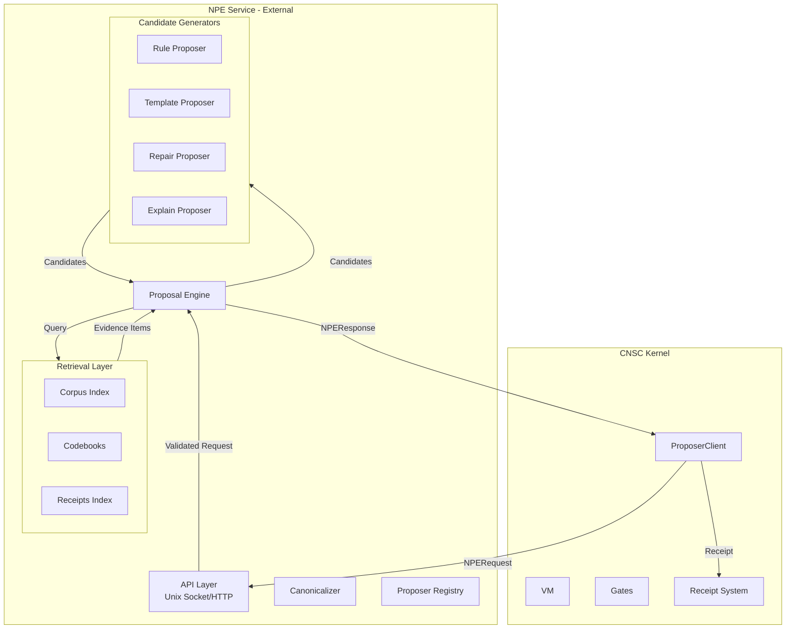
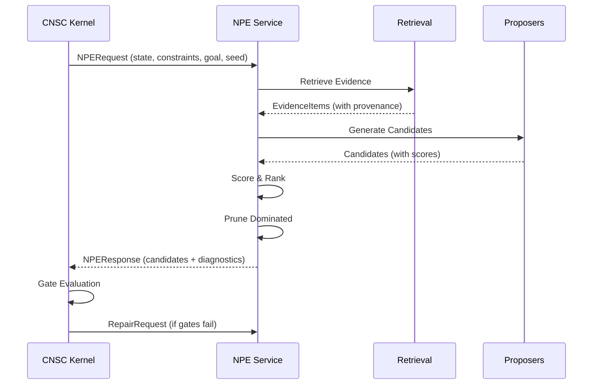

# NPE Implementation Plan

**Noetican Proposal Engine (NPE) Integration with CNSC**  
**Plan Version:** 1.0  
**Date:** 2026-02-08  
**Architectural Decisions:** External service, `gr` domain first, file-based corpus MVP

---

## Executive Summary

This plan outlines the implementation of NPE as an **external proposer service** for CNSC, starting with the `gr` (governance/rules) domain. The implementation follows a phased approach that prioritizes ship-ability, determinism guarantees, and coherence with existing CNSC architecture.

**Key Architectural Choices:**
- Integration: External service via Unix socket (localhost-only)
- Domain Priority: `gr` → `sched` → `control`
- Retrieval: File-based corpus + receipts index (Phase 1-2), Aeonic memory (Phase 6)
- Proposers: Rule + Template + Repair (MVP), Search (Phase 2)

---

## Architecture Overview

### NPE-CNSC Integration Diagram



### Data Flow



---

## Phase 0: Kernel Boundary + Receipts Wiring

**Goal:** CNSC can call NPE and record "what NPE said" as receipts.

### Deliverables

| Component | File | Description |
|-----------|------|-------------|
| `ProposerClient` | `src/cnsc/haai/nsc/proposer_client.py` | Client for NPE service calls |
| Request Schema | `schemas/npe_request.schema.json` | Canonical NPERequest JSON schema |
| Response Schema | `schemas/npe_response.schema.json` | Canonical NPEResponse JSON schema |
| Receipt Extension | `src/cnsc/haai/gml/receipts.py` | Add NPE-specific receipt content |

### NPERequest Schema

```json
{
  "type": "object",
  "properties": {
    "req_id": {"type": "string", "pattern": "^[a-f0-9]{64}$"},
    "domain": {"type": "string", "enum": ["gr", "sched", "control"]},
    "state_ref": {
      "type": "object",
      "properties": {
        "state_hash": {"type": "string"},
        "locator": {"type": "string"},
        "summary": {"type": "object"}
      },
      "required": ["state_hash"]
    },
    "constraints_ref": {
      "type": "object",
      "properties": {
        "constraints_hash": {"type": "string"},
        "locator": {"type": "string"},
        "params": {"type": "object"}
      },
      "required": ["constraints_hash"]
    },
    "goal": {"type": "object"},
    "context": {
      "type": "object",
      "properties": {
        "seed": {"type": "integer"},
        "risk_posture": {"type": "string", "enum": ["conservative", "aggressive"]},
        "determinism_tier": {"type": "string", "enum": ["D0", "D1", "D2"]},
        "resource_budgets": {"type": "object"}
      }
    },
    "seed": {"type": "integer"}
  },
  "required": ["req_id", "domain", "state_ref", "constraints_ref", "goal"]
}
```

### NPEResponse Schema

```json
{
  "type": "object",
  "properties": {
    "req_id": {"type": "string"},
    "response_id": {"type": "string", "pattern": "^[a-f0-9]{64}$"},
    "response_hash": {"type": "string", "pattern": "^[a-f0-9]{64}$"},
    "corpus_snapshot_hash": {"type": "string"},
    "memory_snapshot_hash": {"type": "string"},
    "proposer_registry_hash": {"type": "string"},
    "candidates": {
      "type": "array",
      "items": {"$ref": "#/$defs/Candidate"}
    },
    "diagnostics": {
      "type": "object",
      "properties": {
        "retrieval_stats": {"type": "object"},
        "time_per_stage": {"type": "object"},
        "prune_reasons": {"type": "array"},
        "determinism_tier": {"type": "string"}
      }
    }
  },
  "required": ["req_id", "response_id", "response_hash", "candidates"]
}
```

### Candidate Schema

```json
{
  "$defs": {
    "Candidate": {
      "type": "object",
      "properties": {
        "candidate_id": {"type": "string", "pattern": "^[a-f0-9]{64}$"},
        "candidate_type": {"type": "string", "enum": ["plan", "delta", "solver_config", "repair", "explain"]},
        "domain": {"type": "string"},
        "input_state_hash": {"type": "string"},
        "constraints_hash": {"type": "string"},
        "payload": {"type": "object"},
        "evidence": {
          "type": "array",
          "items": {"$ref": "#/$defs/EvidenceItem"}
        },
        "scores": {
          "type": "object",
          "properties": {
            "utility": {"type": "number"},
            "risk": {"type": "number"},
            "cost": {"type": "number"},
            "confidence": {"type": "number"}
          }
        },
        "suggested_gates": {"type": "array"},
        "seed": {"type": "integer"},
        "proposer_meta": {
          "type": "object",
          "properties": {
            "strategy_id": {"type": "string"},
            "version_hash": {"type": "string"}
          }
        }
      },
      "required": ["candidate_id", "candidate_type", "domain", "input_state_hash", "constraints_hash", "payload", "scores"]
    },
    "EvidenceItem": {
      "type": "object",
      "properties": {
        "evidence_id": {"type": "string"},
        "source_type": {"type": "string", "enum": ["memory", "corpus", "run_receipt", "codebook"]},
        "source_ref": {"type": "string"},
        "content_hash": {"type": "string"},
        "relevance": {"type": "number"},
        "filters_applied": {"type": "array"}
      },
      "required": ["evidence_id", "source_type", "content_hash"]
    }
  }
}
```

### Lean Proof Requirements

- **D0 Determinism:** Identical CNSC state + constraints + seed → identical NPE response hash
- **Receipt Coverage:** All NPE interactions recorded in receipt chain with request_id, response_id, response_hash

---

## Phase 1: NPE Service Skeleton

**Status:** ✅ COMPLETED

### Directory Structure

```
src/npe/
  __init__.py
  api/
    __init__.py
    server.py              # Unix socket / HTTP server
    routes.py              # /propose /repair /health
    wire.py                # JSON parsing, schema validation, canonical IO
  core/
    __init__.py
    canon.py               # CJ0 canonical JSON encoder
    hashing.py             # sha256 helpers + typed hash functions
    time.py                # deterministic timing wrappers for diagnostics
    budgets.py             # budget accounting + enforcement
    errors.py              # error codes + structured exceptions
    types.py               # dataclasses (Request/Evidence/Candidate/Response)
  registry/
    __init__.py
    manifest.yaml          # proposer registry (versioned)
    loader.py              # loads manifest, computes registry_hash
    dispatch.py            # deterministic proposer invocation order
  retrieval/
    __init__.py
    index_build.py         # builds corpus index and snapshot hash
    corpus_store.py        # file-based chunk store + search
    codebook_store.py      # loads rulepacks + repair maps
    receipts_store.py      # reads CNSC JSONL receipts into queryable index
    filters.py             # taint/scenario/time/privacy filters
    query.py               # structured query construction
  proposers/
    __init__.py
    gr/
      __init__.py
      repair_from_gate_reasons.py
      rule_atomic_safety.py
      template_plan_library.py
      explain_receipt_summarizer.py
  scoring/
    __init__.py
    score.py               # utility/risk/cost/confidence scoring
    prune.py               # dedupe + dominance pruning
    rank.py                # stable ranking + tie-breaks
  cli/
    __init__.py
    npe.py                 # `python -m npe.cli.npe ...`
  tests/
    test_canon_hashing.py
    test_determinism_d0.py
    test_filters_taint.py
    test_gr_repairs.py
    fixtures/
      requests/
      repair_requests/
      corpora/
      codebooks/
```

### Assets Directory

```
npe_assets/
  corpus/                    # markdown/docs
  codebooks/
    gr/
      repair_map.yaml
      plan_templates.yaml
      rulepacks.yaml
  receipts/                  # exported CNSC receipts JSONL
  index/                     # built index files + snapshot hash
```

### Completed Components

| Component | Status | File |
|-----------|--------|------|
| Core Types | ✅ | `src/npe/core/types.py` |
| CJ0 Canonicalization | ✅ | `src/npe/core/canon.py` |
| Typed Hashing | ✅ | `src/npe/core/hashing.py` |
| Budgets | ✅ | `src/npe/core/budgets.py` |
| Errors | ✅ | `src/npe/core/errors.py` |
| Time | ✅ | `src/npe/core/time.py` |
| Registry Manifest | ✅ | `src/npe/registry/manifest.yaml` |
| Registry Loader | ✅ | `src/npe/registry/loader.py` |
| Registry Dispatch | ✅ | `src/npe/registry/dispatch.py` |
| API Server | ✅ | `src/npe/api/server.py` |
| API Routes | ✅ | `src/npe/api/routes.py` |
| API Wire | ✅ | `src/npe/api/wire.py` |
| Corpus Store | ✅ | `src/npe/retrieval/corpus_store.py` |
| Codebook Store | ✅ | `src/npe/retrieval/codebook_store.py` |
| Receipts Store | ✅ | `src/npe/retrieval/receipts_store.py` |
| Filters | ✅ | `src/npe/retrieval/filters.py` |
| Query | ✅ | `src/npe/retrieval/query.py` |
| Index Build | ✅ | `src/npe/retrieval/index_build.py` |
| Repair Proposer | ✅ | `src/npe/proposers/gr/repair_from_gate_reasons.py` |
| Rule Proposer | ✅ | `src/npe/proposers/gr/rule_atomic_safety.py` |
| Template Proposer | ✅ | `src/npe/proposers/gr/template_plan_library.py` |
| Explain Proposer | ✅ | `src/npe/proposers/gr/explain_receipt_summarizer.py` |
| Scoring | ✅ | `src/npe/scoring/score.py` |
| Pruning | ✅ | `src/npe/scoring/prune.py` |
| Ranking | ✅ | `src/npe/scoring/rank.py` |
| CLI | ✅ | `src/npe/cli/npe.py` |
| Unit Tests | ✅ | `src/npe/tests/test_*.py` |

### CJ0 Canonicalization Rules (from `core/canon.py`)

- Sort keys lexicographically
- No extra whitespace
- Arrays preserve order
- Numbers normalized (ints as decimal, floats as fixed precision strings)
- UTF-8 encoding

### Typed Hashing Functions (from `core/hashing.py`)

All hashes use format:
`sha256("NPE|1.0|" + <type> + "|" + CJ0(payload))`

- `hash_request(payload) -> request_id`
- `hash_evidence(payload) -> evidence_id`
- `hash_candidate_payload(payload) -> payload_hash`
- `hash_candidate(envelope) -> candidate_hash`
- `hash_response(payload) -> response_id`
- `hash_registry(manifest_normalized) -> registry_hash`
- `hash_corpus_snapshot(sorted_chunk_hashes) -> corpus_snapshot_hash`
- `hash_receipts_snapshot(sorted_receipt_hashes) -> receipts_snapshot_hash`

### API Endpoints

- `POST /npe/v1/propose`
- `POST /npe/v1/repair`
- `GET /npe/v1/health`

### Registry Manifest (from `registry/manifest.yaml`)

```yaml
spec: NPE-REGISTRY-1.0
registry_name: npe_default
registry_version: 1
domain:
  gr:
    enabled: true
    proposer_order:
      - gr.repair.from_gate_reasons
      - gr.rule.atomic_safety
      - gr.template.plan_library
      - gr.explain.receipt_summarizer

proposers:
  gr.repair.from_gate_reasons:
    module: npe.proposers.gr.repair_from_gate_reasons
    entrypoint: propose
    candidate_types: [repair]
    max_outputs: 12
    budgets:
      max_wall_ms: 30

  gr.rule.atomic_safety:
    module: npe.proposers.gr.rule_atomic_safety
    entrypoint: propose
    candidate_types: [solver_config, repair]
    max_outputs: 12
    budgets:
      max_wall_ms: 30

  gr.template.plan_library:
    module: npe.proposers.gr.template_plan_library
    entrypoint: propose
    candidate_types: [plan]
    max_outputs: 16
    budgets:
      max_wall_ms: 40

  gr.explain.receipt_summarizer:
    module: npe.proposers.gr.explain_receipt_summarizer
    entrypoint: propose
    candidate_types: [explain]
    max_outputs: 8
    budgets:
      max_wall_ms: 20
```

### Retrieval MVP

- **Corpus chunking:** 1200 char chunks, 200 char overlap
- **Codebooks:** YAML files for repair maps, plan templates, rulepacks
- **Receipts index:** CNSC JSONL receipts indexed by gate_id, reason_code, outcome
- **Filters:** scenario_scope, time_scope, privacy_scope, trust_scope

### GR Proposers

1. **repair_from_gate_reasons.py**: Maps gate failures to repair actions from `repair_map.yaml`
2. **rule_atomic_safety.py**: Conservative knobs from `rulepacks.yaml`
3. **template_plan_library.py**: Selects plans by `goal_type` from templates
4. **explain_receipt_summarizer.py**: Structured explanation output

### Scoring

- Score candidates by `risk`, `utility`, `cost`, `confidence`
- Prune duplicates by `(candidate_type, payload_hash)`
- Dominance prune by scores
- Stable ranking with deterministic tie-breaks

### CLI Commands

- `python -m npe.cli.npe index --corpus npe_assets/corpus --out npe_assets/index`
- `python -m npe.cli.npe serve --socket /tmp/npe.sock --assets ./npe_assets`
- `python -m npe.cli.npe propose --request <file>`
- `python -m npe.cli.npe repair --request <file>`

### Unit Tests

- `test_canon_hashing.py`: Same dict different key order → same hash
- `test_determinism_d0.py`: Same request 3x → same response_id + candidate hashes
- `test_filters_taint.py`: Cross-scenario evidence filtered by default
- `test_gr_repairs.py`: Gate failures produce expected repair payloads

---

## Phase 2: CNSC Integration (ProposerClient + Receipt Wiring)

**Status:** 📋 PENDING

### A) Create NPE Client (`src/cnsc/haai/nsc/proposer_client.py`)

Create a `NPEClient` class that:

1. **Connects to NPE service** via HTTP (localhost) or Unix socket
2. **Implements `propose()` method**:
   ```python
   def propose(
       self,
       state: Dict[str, Any],
       constraints: Dict[str, Any],
       goal: Dict[str, Any],
       domain: str = "gr",
       seed: int = 42,
       risk_posture: str = "conservative"
   ) -> List[Candidate]:
   ```
3. **Implements `repair()` method**:
   ```python
   def repair(
       self,
       state: Dict[str, Any],
       constraints: Dict[str, Any],
       failure_proof: Dict[str, Any],
       domain: str = "gr",
       seed: int = 42
   ) -> List[Candidate]:
   ```

### B) Integrate with Gate Failure Handling

Modify `src/cnsc/haai/nsc/gates.py` or create a new integration module:

1. **Detects gate failures** (when `gate.decision == GateDecision.FAIL`)
2. **Extracts failure details**:
   - `gate_id`
   - `reason_code`
   - `measures` (diagnostics from gate)
   - `proof_hash`
3. **Calls `npe_client.repair()`** with failure proof bundle
4. **Returns repair candidates** for evaluation

### C) Receipt Integration (`src/cnsc/haai/gml/receipts.py`)

Extend the receipt system to record NPE interactions:

1. **Add new `ReceiptStepType`**:
   ```python
   class ReceiptStepType(Enum):
       # ... existing types ...
       NPE_PROPOSAL = auto()
       NPE_REPAIR = auto()
   ```

2. **Create receipt content for NPE calls**:
   ```python
   @dataclass
   class NPEReceiptContent:
       step_type: str  # "proposal" or "repair"
       request_id: str
       response_id: str
       response_hash: str
       domain: str
       candidate_count: int
       top_candidate_hash: Optional[str]
       corpus_snapshot_hash: str
       registry_hash: str
       diagnostics: Dict[str, Any]
   ```

3. **Integrate with `ReceiptSystem.append()`** to accept NPE receipts

### D) Wire CNSC to Call NPE on Gate Failures

Modify the VM execution flow in `src/cnsc/haai/nsc/vm.py`:

```python
if gate_decision == GateDecision.FAIL:
    repair_candidates = npe_client.repair(
        state=get_current_state(),
        constraints=get_current_constraints(),
        failure_proof={
            "gate_id": gate_id,
            "reason_code": reason_code,
            "measures": measures,
            "proof_hash": compute_proof_hash()
        }
    )
    # Log repair attempt in receipts
    emit_npe_receipt(repair_candidates)
    # Continue with repair evaluation
```

### E) Validate Candidate Hashes

Add validation to ensure candidates are trustworthy:

1. **Recompute candidate hashes** from payload using NPE's hashing functions
2. **Compare with provided hashes** - flag mismatches
3. **Validate evidence references** point to valid sources

### Deliverables

| Component | File | Description |
|-----------|------|-------------|
| NPEClient | `src/cnsc/haai/nsc/proposer_client.py` | HTTP/Unix socket client for NPE |
| Gate Integration | `src/cnsc/haai/nsc/npe_gate_integration.py` | Gate failure → repair request |
| Receipt Extension | `src/cnsc/haai/gml/receipts.py` | NPE receipt step types |
| Validation | `src/cnsc/haai/nsc/candidate_validator.py` | Hash validation |
| Integration Tests | `tests/integration/test_npe_integration.py` | Full integration tests |

### Implementation Rules

1. Use existing CNSC patterns (dataclasses, enums, type hints)
2. Follow seam principles from `spec/seam/00_Seam_Principles.md`
3. Use `requests` library for HTTP calls to NPE
4. Handle NPE service unavailability gracefully (continue without NPE)
5. Include detailed docstrings
6. Add error handling for network timeouts, schema validation failures

### Testing

1. **Test NPE client connection** to running service
2. **Test proposal flow** - request candidates, validate response
3. **Test repair flow** - gate failure → repair request → candidate
4. **Test receipt recording** - verify NPE receipts in chain
5. **Test graceful degradation** - NPE unavailable → continue without

---

## Phase 3: `gr` Domain Proposers (Highest Leverage)

**Status:** ✅ COMPLETED (in Phase 1)

### Required Proposers (MVP)

1. **repair.from_gate_reasons**
   - Input: failing gate ids, reason codes, measures
   - Output: `Candidate(type=repair)` with deterministic repair directives

2. **rule.atomic_safety**
   - Proposes safe knobs: dt scaling, damping increase, clamp options
   - Only proposes changes that never relax hard constraints

3. **template.plan_library**
   - Emits structured action graphs:
     - `stabilize → re-evaluate → advance`
     - `elliptic_cleanup → retry_step`

4. **explain.receipt_summarizer**
   - Structured explanation (no prose) describing:
     - what failed, what repair is proposed, which evidence used

### Lean Proof

- **Same failure proof bundle → same repair candidate hash**

---

## Phase 4: CNSC Gate Integration (Pass-Yield Metric)

**Status:** 📋 PENDING

### Goal

Measure if NPE improves outcomes.

### Implementation

On gate FAIL/SOFT_FAIL:
- CNSC calls `NPERepairRequest`
- Tests that repaired candidate improves gate-pass yield@k

### Metric Report

| Metric | Description |
|--------|-------------|
| `baseline_pass_yield@k` | Pass yield without NPE repairs |
| `npe_pass_yield@k` | Pass yield with NPE repairs |
| `repair_accept_rate` | Fraction of NPE repairs that pass gates |
| `determinism_violations` | Count of non-deterministic responses |

### Lean Proof

- Repairs increase pass-yield on failure suite

---

## Phase 5: Add `sched` Domain (Optional Second)

**Status:** 📋 PENDING

### Goal

Prove cross-domain transfer.

### Proposers

1. **rule/template scheduling templates**
2. **OR-Tools CP-SAT config candidates** (still CPU)
3. Same evidence + provenance + ranking discipline
4. GateStack checks feasibility and constraints

---

## Phase 6: Integrate Aeonic Memory Banks (Taint-Governed)

**Status:** 📋 PENDING

### Goal

Allow case-based proposals + warm starts safely.

### Memory Evidence Items

```python
@dataclass
class MemoryEvidence:
    evidence_id: str
    source_type: str = "memory"
    source_ref: str  # Memory bank locator
    content_hash: str
    relevance: float
    
    # Taint governance
    taint_tags: List[str]       # scenario:<id>, trust:<level>
    scenario_id: Optional[str]  # None = cross-scenario allowed
    time_scope: Optional[str]   # "t<=now" for causal safety
    privacy_scope: str          # "local", "restricted"
```

### Taint Enforcement

- No cross-scenario unless allowlisted
- No future leak
- Add `memory.case_based` proposer

### Lean Proof

- **Tainted memory never influences candidates** (filtered with reason)

---

## Integration Contracts

### Contract 1: CNSC → NPE (Propose)

**Preconditions:**
1. Valid VM state snapshot
2. Constraint set loaded
3. Receipt system initialized
4. NPE service reachable

**Postconditions:**
1. NPEResponse received with valid structure
2. All candidates have provenance
3. Diagnostics included

**Error Handling:**

| Condition | Action |
|-----------|--------|
| NPE service unreachable | Continue with rule-based fallback |
| Schema validation failed | Reject request, emit error receipt |
| Timeout (200ms default) | Return partial response + timeout diagnostic |

### Contract 2: CNSC → NPE (Repair)

**Trigger:** Gate evaluation returns FAIL or SOFT_FAIL

**Input:**
```python
NPERepairRequest(
    req_id="...",
    domain="gr",
    state_ref={"state_hash": "..."},
    constraints_ref={"constraints_hash": "..."},
    failure_proof={
        "gate_id": "affordability",
        "reason_code": "dt_instability",
        "measures": {"current_dt": 0.01, "violation_magnitude": 0.5}
    },
    context={"risk_posture": "conservative"},
    seed=42
)
```

**Output:** NPEResponse with repair candidates

### Contract 3: NPE → Receipt System

Every NPE interaction generates a receipt:

```python
ReceiptContent(
    step_type=ReceiptStepType.NSC_PROPOSAL,
    input_hash=request_hash,
    output_hash=response_hash,
    decision=ReceiptDecision.PASS,
    details={
        "req_id": request.req_id,
        "response_id": response.response_id,
        "candidate_count": len(response.candidates),
        "top_candidate_id": response.candidates[0].candidate_id if response.candidates else None,
        "diagnostics": response.diagnostics
    },
    coherence_before=None,
    coherence_after=None
)
```

---

## Testing Strategy

### Phase 0-1 Tests (Determinism)

```python
def test_deterministic_proposal():
    """Same inputs → same candidate hashes."""
    request = create_test_request(seed=42)
    
    response1 = npe.propose(request)
    response2 = npe.propose(request)
    
    assert response1.response_hash == response2.response_hash
    assert len(response1.candidates) == len(response2.candidates)
    assert all(c1.candidate_id == c2.candidate_id 
               for c1, c2 in zip(response1.candidates, response2.candidates))
```

### Phase 2-3 Tests (Provenance)

```python
def test_candidate_provenance():
    """Every candidate has evidence or explicit no-evidence flag."""
    response = npe.propose(create_test_request())
    
    for candidate in response.candidates:
        if not candidate.evidence:
            assert candidate.proposer_meta.get("no_evidence_allowed") == True
        else:
            for evidence in candidate.evidence:
                assert evidence.filters_applied is not None
```

### Phase 4 Tests (Repair Effectiveness)

```python
def test_repair_improves_yield():
    """Repairs increase gate pass yield."""
    failure_suite = load_failure_suite()
    
    baseline_yield = measure_yield(failure_suite, use_npe=False)
    npe_yield = measure_yield(failure_suite, use_npe=True)
    
    assert npe_yield > baseline_yield
```

### Phase 6 Tests (Taint Safety)

```python
def test_taint_filtering():
    """Tainted memory never influences candidates."""
    evidence = create_evidence_with_taint(
        scenario_id="blocked_scenario",
        timestamp=datetime.now() + timedelta(hours=1)  # Future
    )
    
    filtered, violations = taint_filter.filter(
        evidence, 
        allowed_scenarios=["scenario_a"]
    )
    
    assert len(filtered) == 0
    assert len(violations) == 1
```

---

## Milestones Summary

| Phase | Deliverable | Status | Key Verification |
|-------|-------------|--------|------------------|
| 1 | NPE service skeleton | ✅ Complete | Schema validation, canonicalization |
| 2 | CNSC integration | 📋 Pending | Client, receipt wiring, gate integration |
| 3 | `gr` domain proposers | ✅ Complete | Same failure → same repair hash |
| 4 | Gate integration | 📋 Pending | Pass-yield improvement |
| 5 | `sched` domain (optional) | 📋 Pending | Cross-domain transfer |
| 6 | Aeonic memory integration | 📋 Pending | Taint enforcement |

---

## Next Steps

### Immediate (Continue Phase 2)

1. **Implement NPEClient** in `src/cnsc/haai/nsc/proposer_client.py`
2. **Extend receipt system** for NPE step types
3. **Integrate with gate failures** in `src/cnsc/haai/nsc/gates.py`
4. **Write integration tests** in `tests/integration/test_npe_integration.py`
5. **Validate candidate hashes** for trust

### After Phase 2

1. Measure pass-yield improvement (Phase 4)
2. Add `sched` domain (Phase 5, optional)
tests/integration/
├── test_npe_service.py
├── test_gate_repair.py
└── test_receipt_wiring.py
```

---

## Milestones Summary

| Phase | Deliverable | Key Verification |
|-------|-------------|------------------|
| 0 | ProposerClient + Receipt wiring | D0 determinism, receipt coverage |
| 1 | NPE service skeleton | Schema validation, canonicalization |
| 2 | Retrieval MVP | Evidence provenance, stable ordering |
| 3 | `gr` domain proposers | Same failure → same repair hash |
| 4 | Gate integration | Pass-yield improvement |
| 5 | `sched` domain (optional) | Cross-domain transfer |
| 6 | Aeonic memory integration | Taint enforcement |

---

## Next Steps

1. **Approve this plan** → Switch to Code mode for Phase 0 implementation
2. **Create schemas/** directory and JSON schemas
3. **Implement ProposerClient** in `src/cnsc/haai/nsc/`
4. **Implement NPE service skeleton** in `src/cnsc/haai/npe/`
