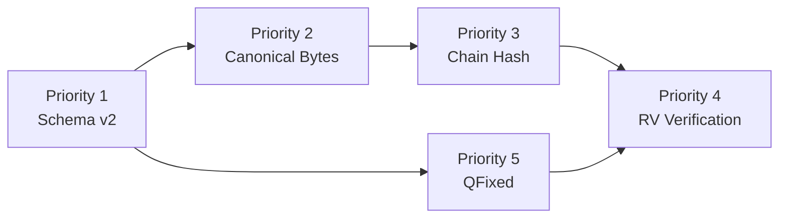

# ATS Kernel Fix Plan

**Created:** 2026-02-20  
**Status:** ✅ MOSTLY COMPLETED - QFixed issues remain
**Purpose:** Make ATS kernel "true in code" — not just true in docs

> **The Acid Test:** Can an untrusted runtime propose a transition that RV accepts *without* actually respecting the risk/budget law? If yes → "logging" not "kernel."

---

## Executive Summary

This plan addresses:
1. **5 Core Code Gaps** — Fundamental violations of coherence kernel invariants
2. **10 Extended Spec Gaps** — Ambiguities that create attack surfaces

Each item threatens to make ATS "a clever demo" rather than a real stability kernel.

---

## Issue Summary

| # | Severity | Issue | Current State |
|---|----------|-------|---------------|
| 1 | CRITICAL | Receipt schema v1 is consensus-unsafe | ✅ FIXED - v2/v3 schemas exist |
| 2 | CRITICAL | canonical_bytes() includes non-deterministic fields | ✅ FIXED - canonical_bytes_core() exists |
| 3 | CRITICAL | chain_hash doesn't bind to content | ✅ FIXED - content-bound formula implemented |
| 4 | CRITICAL | verify_trajectory uses placeholder state/action | ✅ FIXED - uses receipt data only |
| 5 | CRITICAL | QFixed has silent saturation + floors negatives | ⚠️ PARTIAL - QFixedDelta exists, silent cap remains |

---

## Priority 1: Add ATS Receipt Schema v2

**Problem:** [`schemas/receipt.schema.json`](schemas/receipt.schema.json) v1 requires timestamps and floats, violating ATS consensus requirements.

**Solution:** Create separate ATS v2 schema for consensus-critical receipts.

### Files to Create/Modify

| # | File | Action |
|---|------|--------|
| 1.1 | `schemas/receipt.ats.v2.schema.json` | **CREATE** - ATS-specific schema |
| 1.2 | `schemas/receipt.schema.json` | **UPDATE** - Add description marking as "telemetry only" |
| 1.3 | `src/cnsc/haai/ats/types.py` | **UPDATE** - Add `receipt_type` field distinguishing ATS vs telemetry |

### ATS v2 Schema Requirements

```json
{
  "$schema": "https://json-schema.org/draft/2020-12/schema",
  "$id": "https://cnsc-haai.io/schemas/receipt.ats.v2.schema.json",
  "title": "ATS Consensus Receipt Schema v2.0.0",
  "description": "Deterministic, consensus-safe receipt for ATS kernel verification",
  "type": "object",
  "required": ["version", "receipt_id", "receipt_core", "chain_hash"],
  "properties": {
    "version": { "const": "2.0.0" },
    "receipt_id": { "$ref": "#/definitions/receipt_id" },
    "receipt_core": { "$ref": "#/definitions/receipt_core" },
    "chain_hash": { "$ref": "#/definitions/chain_hash" },
    "telemetry": { "description": "Non-consensus metadata (not in canonical bytes)" }
  },
  "definitions": {
    "receipt_core": {
      "type": "object",
      "required": ["step_index", "content"],
      "properties": {
        "step_index": { "type": "integer", "minimum": 0 },
        "content": { "$ref": "#/definitions/receipt_content" }
      }
    },
    "receipt_content": {
      "type": "object",
      "required": ["risk_before", "risk_after", "budget_before", "budget_after", "kappa", "state_hash_before", "state_hash_after"],
      "properties": {
        "risk_before": { "$ref": "#/definitions/qfixed" },
        "risk_after": { "$ref": "#/definitions/qfixed" },
        "budget_before": { "$ref": "#/definitions/qfixed" },
        "budget_after": { "$ref": "#/definitions/qfixed" },
        "kappa": { "$ref": "#/definitions/qfixed" },
        "state_hash_before": { "$ref": "#/definitions/sha256_hex" },
        "state_hash_after": { "$ref": "#/definitions/sha256_hex" },
        "decision": { "enum": ["PASS", "FAIL"] }
      }
    },
    "qfixed": {
      "type": "object",
      "required": ["raw"],
      "properties": {
        "raw": { "type": "integer", "description": "QFixed(18) raw integer value" }
      }
    },
    "sha256_hex": {
      "type": "string",
      "pattern": "^[a-f0-9]{64}$"
    },
    "receipt_id": {
      "type": "string",
      "pattern": "^[a-f0-9]{8}$"
    },
    "chain_hash": {
      "type": "string",
      "pattern": "^[a-f0-9]{64}$"
    }
  }
}
```

---

## Priority 2: Define Canonical Bytes Over receipt_core Only

**Problem:** In [`src/cnsc/haai/ats/types.py`](src/cnsc/haai/ats/types.py:241), `Receipt.canonical_bytes()` includes:
- `timestamp`
- `episode_id`
- `provenance`
- `signature`
- `metadata`

This violates `docs/ats/20_coh_kernel/receipt_identity.md` (no timestamps in ID).

### Files to Modify

| # | File | Change |
|---|------|--------|
| 2.1 | `src/cnsc/haai/ats/types.py` | Split Receipt into `ReceiptCore` + `ReceiptMeta` |
| 2.2 | `src/cnsc/haai/ats/types.py` | Add `Receipt.canonical_bytes_core()` method |
| 2.3 | `src/cnsc/haai/ats/types.py` | Update `compute_receipt_id()` to use canonical_bytes_core() |
| 2.4 | `docs/ats/20_coh_kernel/receipt_identity.md` | Document the split structure |

### Implementation Pattern

```python
@dataclass(frozen=True)
class ReceiptCore:
    """Consensus-critical receipt data (for canonical bytes)."""
    step_index: int
    content: ReceiptContent
    
    def canonical_bytes(self) -> bytes:
        """Only content that affects receipt_id and chain_hash."""
        return self.content.canonical_bytes()

@dataclass
class ReceiptMeta:
    """Non-consensus metadata (excluded from canonical bytes)."""
    timestamp: Optional[str] = None
    episode_id: Optional[str] = None
    provenance: Dict[str, Any] = field(default_factory=dict)
    signature: Dict[str, Any] = field(default_factory=dict)
    metadata: Dict[str, Any] = field(default_factory=dict)

@dataclass
class Receipt:
    """Full receipt with core + meta separation."""
    version: str = "2.0.0"
    receipt_id: str = ""
    core: ReceiptCore = None
    meta: ReceiptMeta = None
    chain_hash: str = ""
    
    def canonical_bytes(self) -> bytes:
        """Only canonical bytes for deterministic hashing."""
        return self.core.canonical_bytes()
```

---

## Priority 3: Replace chain_hash Rule

**Problem:** In [`src/cnsc/haai/ats/types.py`](src/cnsc/haai/ats/types.py:287), `compute_chain_hash()` uses:
```python
chain_input = prev_receipt_id + self.receipt_id
```

This doesn't bind to receipt content, allowing chain forks.

### Files to Modify

| # | File | Change |
|---|------|--------|
| 3.1 | `src/cnsc/haai/ats/types.py` | Update `compute_chain_hash(prev_chain_hash, core_bytes)` |
| 3.2 | `src/cnsc/haai/ats/rv.py` | Update chain verification to use new formula |
| 3.3 | `docs/ats/20_coh_kernel/chain_hash_rule.md` | Document new rule |

### New Chain Hash Formula

```python
def compute_chain_hash(self, prev_chain_hash: str, core_bytes: bytes) -> str:
    """
    Chain hash binds to receipt content, not just IDs.
    
    Per docs/ats/20_coh_kernel/chain_hash_rule.md:
        chain_hash[n] = sha256(chain_hash[n-1] || canonical_bytes(receipt_core[n]))
    """
    import hashlib
    chain_input = prev_chain_hash.encode() + core_bytes
    return hashlib.sha256(chain_input).hexdigest()
```

---

## Priority 4: Make RV Verify Trajectories Using Only Receipt Data

**Problem:** In [`src/cnsc/haai/ats/rv.py`](src/cnsc/haai/ats/rv.py:334), `verify_trajectory()` uses:
```python
state_after=current_state,  # Placeholder!
action=Action(ActionType.CUSTOM),  # Placeholder!
```

This means trajectory verification is **not actually verifying** anything.

### Files to Modify

| # | File | Change |
|---|------|--------|
| 4.1 | `src/cnsc/haai/ats/rv.py` | Remove state_after parameter from verify_trajectory |
| 4.2 | `src/cnsc/haai/ats/rv.py` | Use receipt content's state_hash_before/after for verification |
| 4.3 | `src/cnsc/haai/ats/rv.py` | Store state hash chain, verify monotonically |
| 4.4 | `src/cnsc/haai/ats/rv.py` | Verify action via action hash in receipt content |

### New verify_trajectory Signature

```python
def verify_trajectory(
    self,
    initial_state_hash: str,
    initial_budget: QFixed,
    receipts: list,  # List of Receipt with full content
    kappa: QFixed = None,
) -> Tuple[bool, Optional[ATSError]]:
    """
    Verify trajectory using ONLY receipt data.
    
    - initial_state_hash: Starting state (provided externally)
    - Each receipt must contain:
      - state_hash_before (links to previous)
      - state_hash_after (for next link)
      - risk values (for V verification)
      - budget values (for B verification)
    """
    kappa = kappa or self.kappa
    
    # Reset verifier state
    self._previous_receipt_id = GENESIS_RECEIPT_ID
    self.budget_manager = BudgetManager(initial_budget, kappa)
    
    expected_state_hash = initial_state_hash
    
    for i, receipt in enumerate(receipts):
        # Get content from receipt (not runtime)
        content = receipt.core.content
        
        # Verify state hash chain
        if content.state_hash_before != expected_state_hash:
            return False, StateHashMismatchError(
                expected_state_hash, 
                content.state_hash_before
            )
        
        # Verify using ONLY receipt data (no runtime state)
        accepted, error = self._verify_from_receipt_content(
            content=content,
            receipt=receipt,
            kappa=kappa,
        )
        
        if not accepted:
            return False, error
        
        # Update expected state for next step
        expected_state_hash = content.state_hash_after
        
        # Update budget
        self.budget_manager.budget = content.budget_after_q
        
        # Update previous receipt ID
        self._previous_receipt_id = receipt.receipt_id
    
    return True, None
```

---

## Priority 5: Fix QFixed Semantics

**Problem:** In [`src/cnsc/haai/ats/numeric.py`](src/cnsc/haai/ats/numeric.py:64):

1. **Silent saturation**: `if value > MAX_VALUE: value = MAX_VALUE` (line 67-68)
2. **Negative floor**: `if value < 0: raise QFixedInvalid` (line 64-65) - but subtraction returns 0 for negatives

This breaks ATS math: you can't represent negative deltas, and silent capping makes proofs ambiguous.

### Files to Modify

| # | File | Change |
|---|------|--------|
| 5.1 | `src/cnsc/haai/ats/numeric.py` | Add signed intermediate representation |
| 5.2 | `src/cnsc/haai/ats/numeric.py` | Replace silent saturation with explicit overflow rejection |
| 5.3 | `src/cnsc/haai/ats/numeric.py` | Add `compute_delta()` method for signed delta |
| 5.4 | `src/cnsc/haai/ats/risk.py` | Update risk computation to use new methods |

### New QFixed Design

```python
class QFixed:
    """
    Deterministic fixed-point with VERIFIER-APPROPRIATE semantics.
    
    Key changes from v1:
    - No silent saturation (overflow = rejection in consensus paths)
    - Signed deltas allowed via comparison/delta methods
    """
    
    def __init__(self, value: int):
        """Create QFixed. REJECTS negative or overflow in consensus paths."""
        if value < 0:
            raise QFixedInvalid(f"Negative values forbidden in consensus: {value}")
        if value > MAX_VALUE:
            raise QFixedOverflow(f"Value exceeds MAX_VALUE in consensus: {value}")
        self.value = value
    
    def compute_delta(self, other: QFixed) -> QFixedDelta:
        """
        Compute signed delta between two QFixed values.
        
        Returns a delta object that knows its sign, allowing correct
        budget law enforcement without silent negative→zero conversion.
        """
        return QFixedDelta(self.value - other.value)  # Can be negative!
    
    def __sub__(self, other: QFixed) -> QFixed:
        """
        Subtraction for consensus paths.
        
        NOTE: For budget law, use compute_delta() instead to get signed result.
        This method is for cases where negatives should error.
        """
        result = self.value - other.value
        if result < 0:
            raise QFixedInvalid(f"Negative result not allowed: {self} - {other}")
        return QFixed(result)


class QFixedDelta:
    """Signed delta for budget law computation."""
    
    def __init__(self, raw_delta: int):
        self.raw = raw_delta  # Can be negative!
    
    def is_positive(self) -> bool:
        return self.raw > 0
    
    def is_negative(self) -> bool:
        return self.raw < 0
    
    def abs_value(self) -> QFixed:
        """Absolute value as QFixed."""
        return QFixed(abs(self.raw))
    
    def plus(self) -> QFixed:
        """max(0, delta) for budget law."""
        return QFixed(max(0, self.raw))
```

---

## Dependencies and Execution Order



| Priority | Depends On | Can Start After |
|----------|------------|-----------------|
| 1 (Schema) | - | Immediately |
| 2 (Canonical) | 1 | 1 complete |
| 3 (Chain Hash) | 2 | 2 complete |
| 4 (RV) | 2, 3 | 2+3 complete |
| 5 (QFixed) | - | Immediately (parallel with 1-3) |

---

## Success Criteria

After all 5 priorities complete:

- [ ] ATS receipts are deterministic (no timestamps in ID)
- [ ] Chain hash binds to content (not just IDs)
- [ ] RV verifies trajectories from receipt data only
- [ ] QFixed math is verifiably correct (no silent failures)
- [ ] Schema v2 exists separate from v1 telemetry schema
- [ ] All existing tests pass (or updated to match new behavior)

---

## Backward Compatibility Notes

- v1 receipts (timestamps, floats) become "telemetry only"
- Bridge layer must convert v1 → v2 for ATS kernel
- Non-ATS paths can continue using v1

---

# Part 2: Extended Spec Gaps (10 Threats)

These are **specification ambiguities** that create attack surfaces even if code is fixed.

---

## Gap A: State Ambiguity — What exactly is "the state"?

**Problem:** Multiple meanings of "state" exist in the codebase:
- Full cognitive state (beliefs/memory/plan)
- Reduced "digest-only" state
- Implicit runtime state

Without freezing this, ATS is unverifiable theater.

### Required Deliverables

| # | Deliverable | Description |
|---|-------------|-------------|
| A.1 | Define `StateCore` contract | Exact fields in consensus state |
| A.2 | Document commitment scheme | Merkle roots, partial commitments |
| A.3 | Define challenge/opening rules | How verifier recomputes state_hash |

### Implementation

```python
@dataclass(frozen=True)
class StateCore:
    """
    Consensus-critical state.
    
    Only fields here affect state_hash and risk computation.
    """
    belief: BeliefState
    memory: MemoryState
    plan: PlanState
    policy: PolicyState
    io: IOState
    
    # Merkle root option for large states
    commitment: Optional[str] = None
    
    def canonical_bytes(self) -> bytes:
        """Exact format for hashing."""
        ...

@dataclass
class StateExtension:
    """
    Non-consensus state data.
    
    Never affects state_hash or risk.
    """
    cache: Dict[str, Any] = field(default_factory=dict)
    runtime_hints: Dict[str, Any] = field(default_factory=dict)
```

---

## Gap B: Risk Witness Threat — V can be faked

**Problem:** `risk.witness` is optional/unconstrained. RV cannot verify V(x), only that receipt claims it.

**Two regimes to choose from:**

### Regime 1: RV Recomputes V (Simpler)

```python
def verify_step(self, receipt: Receipt, state: State) -> bool:
    # RV must have full state to recompute
    computed_v = self.risk_functional.compute(state)
    return computed_v == receipt.content.risk_after_q
```

### Regime 2: Verify Bound (Scalable)

```python
@dataclass
class RiskWitness:
    """Structured witness for bound verification."""
    commitment: str  # Merkle root of risk components
    opening: Dict[str, QFixed]  # Selective opening
    bound: QFixed  # Upper bound on V
    
    def verify_upper_bound(self, claimed_risk: QFixed) -> bool:
        """Verify claimed_risk ≤ bound."""
        return claimed_risk <= self.bound
```

### Required Deliverables

| # | Deliverable | Description |
|---|-------------|-------------|
| B.1 | Choose regime | Document which approach |
| B.2 | Update risk_functional_V.md | State the choice |
| B.3 | Implement witness if Regime 2 | Add structured witness types |

---

## Gap C: Action Semantics Threat — Bytes hashed but meaning drifts

**Problem:** Action bytes are hashed, but:
- Interpretation is not frozen
- No versioning discipline
- No semantic constraints

### Required Deliverables

| # | Deliverable | Description |
|---|-------------|-------------|
| C.1 | Add Action Codec Contract | Versioned type strings |
| C.2 | Define allowed codecs | `nsc.op.v1`, `tool.call.v1` |
| C.3 | Update action_emission_contract.md | Document versioning |

### Implementation

```python
class ActionType(Enum):
    # Versioned action types
    NSC_OP_V1 = "nsc.op.v1"
    TOOL_CALL_V1 = "tool.call.v1"
    CUSTOM = "custom"  # Only for testing

@dataclass
class Action:
    """Versioned action with deterministic codec."""
    action_type: str  # Must be versioned!
    version: str  # e.g., "v1"
    payload: bytes  # Deterministic encoding
    
    def validate_codec(self) -> bool:
        """Reject unknown/old versions."""
        return self.version in SUPPORTED_VERSIONS
```

---

## Gap D: Replay Sovereignty Threat — Genesis undefined

**Problem:** 
- Where does `expected_prev_state_hash` come from?
- What is the genesis state?
- How are checkpoints anchored?

### Required Deliverables

| # | Deliverable | Description |
|---|-------------|-------------|
| D.1 | Define genesis receipt | `prev_chain_hash = "00..00"` |
| D.2 | Define genesis state | Explicit genesis state hash |
| D.3 | Define checkpoint format | Signed checkpoint structure |

### Implementation

```python
GENESIS_CHAIN_HASH = "0000000000000000000000000000000000000000000000000000000000000000"
GENESIS_STATE_HASH = "e3b0c44298fc1c149afbf4c8996fb92427ae41e4649b934ca495991b7852b855"  # SHA256(empty)

@dataclass
class Checkpoint:
    """Signed checkpoint for replay anchoring."""
    state_hash: str
    chain_hash: str
    budget: QFixed
    signature: Dict[str, Any]  # Or deterministic commitment
```

---

## Gap E: Budget Units Threat — κ underspecified

**Problem:**
- No units defined for V, B, κ
- Can "win" by choosing κ = 0 or scaling V by 10⁻¹²
- No invariance guarantees

### Required Deliverables

| # | Deliverable | Description |
|---|-------------|-------------|
| E.1 | Define unit conventions | V in "risk micro-units", B in "budget micro-units" |
| E.2 | Define κ range | Allowed κ values |
| E.3 | Document default κ | Recommended default |
| E.4 | State rescaling behavior | Invariant or not under scaling |

### Implementation

```python
# Unit conventions
RISK_UNIT = 1  # 1 QFixed unit = 1 "risk micro-unit"
BUDGET_UNIT = 1  # 1 QFixed unit = 1 "budget micro-unit"

# κ must be in this range
MIN_KAPPA = QFixed(1)      # κ ≥ 1
MAX_KAPPA = QFixed(1000)   # κ ≤ 1000
DEFAULT_KAPPA = QFixed(1)  # κ = 1

# Budget law uses these units directly
# No hidden scaling factors
```

---

## Gap F: Non-consensus Data Threat — Meta field leakage

**Problem:** Meta fields exist but not proven to be ignored.

### Required Deliverables

| # | Deliverable | Description |
|---|-------------|-------------|
| F.1 | Explicit policy statement | "meta never affects hashes" |
| F.2 | CI test | Receipt with changed meta, identical chain_hash |

### Test

```python
def test_meta_does_not_affect_chain_hash():
    """Meta changes must not affect chain_hash."""
    receipt = create_receipt()
    original_chain_hash = receipt.chain_hash
    
    # Change all meta fields
    receipt.meta.timestamp = "2099-01-01T00:00:00Z"
    receipt.meta.provenance = {"hacked": True}
    receipt.meta.signature = {"fake": "signature"}
    
    # Chain hash MUST be identical
    assert receipt.chain_hash == original_chain_hash
```

---

## Gap G: Reason Codes Threat — Nondeterministic rejection

**Problem:** Different nodes may reject for different reasons → no consensus.

### Required Deliverables

| # | Deliverable | Description |
|---|-------------|-------------|
| G.1 | Enforce precedence in code | RV returns first failure only |
| G.2 | Add test_rejection_precedence.py | Craft receipts failing multiple checks |

### Implementation

```python
# Rejection precedence (must match docs)
REJECTION_PRECEDENCE = [
    InvalidChainLinkError,      # 1. Chain broken
    StateHashMismatchError,    # 2. State hash wrong
    RiskMismatchError,         # 3. Risk values don't match
    BudgetViolationError,      # 4. Budget law violated
    InvalidReceiptHashError,   # 5. Receipt hash invalid
]

def verify_step(self, ...) -> Tuple[bool, Optional[ATSError]]:
    errors = []
    
    # Check in precedence order
    for error_class in REJECTION_PRECEDENCE:
        error = self._check_xxx(...)
        if error:
            return False, error  # Return FIRST failure
    
    return True, None
```

---

## Gap H: Slab Compression Threat — May break invariants

**Problem:** Slab receipts could hide budget violations unless proven safe.

### Required Deliverables

| # | Deliverable | Description |
|---|-------------|-------------|
| H.1 | Mark slab as non-consensus | Until CRT implemented |
| H.2 | Document slab_invariant | What must hold for slabs |

### Implementation

```python
# In docs/ats/30_ats_runtime/slab_compression_rules.md:
"""
## Warning: Non-Consensus Optimization

Slab compression is a performance optimization ONLY.
It does NOT participate in consensus until:
- CRT (Committed Receipt Tree) is implemented
- Slab invariant is formally proven

The global budget inequality must hold for micro-receipts.
Slabs are optional summarization, not verification.
"""
```

---

## Gap I: Compositionality Threat — Parallel composition undefined

**Problem:** If `⊗` (tensor) is ever used:
- How do budgets add?
- How do risk functionals compose?
- What does "concurrent" mean?

### Required Deliverables

| # | Deliverable | Description |
|---|-------------|-------------|
| I.1 | Define tensor semantics | Exact definition for ⊗ |
| I.2 | Define budget addition | B₁ ⊗ B₂ = ? |
| I.3 | Define risk addition | V₁ ⊗ V₂ = ? |
| I.4 | Provide counterexample | Why cartesian product fails |

### Implementation

```python
# In docs/ats/90_roadmap/tensor_resource_semantics.md:
"""
## Tensor Composition Laws

For parallel subsystems S₁ ⊗ S₂:

### Budget Additivity
B_total = B₁ + B₂  (simple addition)

### Risk... NOT additive!
V_total ≠ V₁ + V₂  (risk is not a resource)

Instead:
- If independent: V_total = max(V₁, V₂)
- If interacting: V_total requires interaction matrix

### Counterexample

Cartesian product X × Y fails because:
- (x₁, y₁) and (x₂, y₂) can have individual risk < threshold
- But (x₁, y₂) can have combined risk >> threshold
- Therefore no simple product law exists
"""
```

---

## Gap J: Two Coherence Systems Threat — CK-0 vs UI confusion

**Problem:**
- `cnhaai/core/coherence.py` (heuristic/float)
- ATS risk (deterministic/fixed-point)

Developers may use wrong one.

### Required Deliverables

| # | Deliverable | Description |
|---|-------------|-------------|
| J.1 | Rename heuristic module | `ui_coherence_score.py` |
| J.2 | Firewall imports | RV imports only deterministic |
| J.3 | Add doc warning | "Non-consensus - do not use in RV" |

### Implementation

```
cnhaai/core/
  ui_coherence_score.py    # OLD: float, non-consensus
  ats_risk_functional.py   # NEW: deterministic, consensus

# In rv.py:
from ats.risk import RiskFunctional  # CORRECT
# NOT from cnhaai.core.coherence import ...  # WRONG
```

---

## Extended Gaps: Summary Table

| Gap | Threat | Severity | Deliverables |
|-----|--------|----------|--------------|
| A | State ambiguity | CRITICAL | StateCore contract |
| B | Risk witness faked | CRITICAL | Choose regime + implement |
| C | Action semantics drift | MAJOR | Versioned codec contract |
| D | Genesis undefined | CRITICAL | Genesis receipt/state |
| E | κ units undefined | MAJOR | Unit conventions |
| F | Meta leakage | MAJOR | CI test for invariance |
| G | Rejection nondeterminism | MAJOR | Precedence enforcement |
| H | Slab invariant unproven | MEDIUM | Mark non-consensus |
| I | Composition undefined | MEDIUM | Tensor semantics |
| J | Two coherence systems | MAJOR | Rename + firewall |

---

## Complete Execution Order

```
Phase 1: Core Fixes (5 items)
├── Priority 1: Schema v2
├── Priority 2: Canonical bytes
├── Priority 3: Chain hash
├── Priority 4: RV verification
└── Priority 5: QFixed semantics

Phase 2: Extended Gaps (10 items)
├── Gap A: StateCore contract
├── Gap B: Risk witness regime
├── Gap C: Action codec versioning
├── Gap D: Genesis definition
├── Gap E: Unit conventions
├── Gap F: Meta invariance test
├── Gap G: Rejection precedence
├── Gap H: Slab disclaimer
├── Gap I: Tensor semantics
└── Gap J: Coherence firewall
```

---

## The Kernel Truth Test

After ALL gaps are closed, ATS passes the acid test:

> **A totally untrusted runtime CANNOT propose a transition that RV accepts without respecting risk/budget law.**

This is what makes ATS a real stability kernel, not a clever demo.
